<p align="center"> 
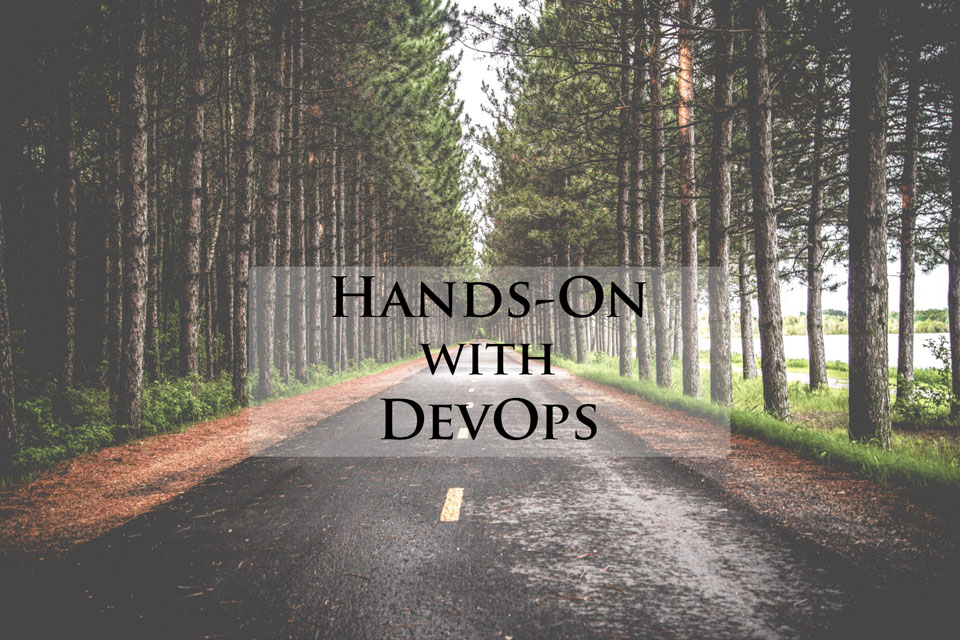
</p>

<!-- TOC -->

- [Introduction to DevOps](#introduction-to-devops)
- [Development](#development)
    - [Containers and Docker](#containers-and-docker)
    - [Modern application development with containers](#modern-application-development-with-containers)
    - [Setting your development environment](#setting-your-development-environment)
    - [Your first container](#your-first-container)
    - [Building a complete microservices-based application](#building-a-complete-microservices-based-application)
    - [Working on your code](#working-on-your-code)
    - [May I use WebEx Teams to vote?](#may-i-use-webex-teams-to-vote)
    - [How to publish your images](#how-to-publish-your-images)
    - [Microservices management](#microservices-management)
- [Operations](#operations)
    - [On-premises deployment](#on-premises-deployment)
        - [No hardware for you?](#no-hardware-for-you)
        - [MiniDC features](#minidc-features)
        - [How to build your own cluster](#how-to-build-your-own-cluster)
        - [External connectivity](#external-connectivity)
        - [Additional tools](#additional-tools)
        - [Architecture-specific images](#architecture-specific-images)
        - [Deploying your application](#deploying-your-application)
        - [What about Web and WebEx Teams?](#what-about-web-and-webex-teams)
        - [Now we need queues](#now-we-need-queues)
        - [A Dashboard to manage them all](#a-dashboard-to-manage-them-all)
        - [Monitoring your cluster and applications](#monitoring-your-cluster-and-applications)
    - [Public Cloud deployment](#public-cloud-deployment)
        - [GKE setup](#gke-setup)
        - [Disable DDNS](#disable-ddns)
        - [Application deployment](#application-deployment)
        - [Cluster management](#cluster-management)
    - [Helm package manager](#helm-package-manager)
    - [Service Mesh](#service-mesh)
        - [Installing Istio](#installing-istio)
        - [Use case 1: routing to specific service version](#use-case-1-routing-to-specific-service-version)
        - [Use case 2: delay injection](#use-case-2-delay-injection)
        - [Use case 3: HTTP abort injection](#use-case-3-http-abort-injection)
        - [Use case 4: gradual migration to new version](#use-case-4-gradual-migration-to-new-version)
        - [Use case 5: mirroring traffic](#use-case-5-mirroring-traffic)
        - [Uninstalling Istio](#uninstalling-istio)
    - [On-prem vs Cloud](#on-prem-vs-cloud)
        - [Differences](#differences)
        - [Similarities](#similarities)
- [Continuous Integration, Delivery and Deployment](#continuous-integration-delivery-and-deployment)
    - [Introduction](#introduction)
    - [What is CI/CD/CD](#what-is-cicdcd)
    - [Pipeline infrastructure](#pipeline-infrastructure)
        - [Version Control Server](#version-control-server)
        - [Integration Server](#integration-server)
    - [Working with pipelines](#working-with-pipelines)
        - [Pipeline setup](#pipeline-setup)
        - [Pipeline definition and requirements](#pipeline-definition-and-requirements)
        - [Pipeline implementation](#pipeline-implementation)
        - [Running your pipeline](#running-your-pipeline)
        - [Pipeline on-premises](#pipeline-on-premises)
- [Additional tools](#additional-tools-1)
    - [Draft](#draft)
    - [Telepresence](#telepresence)
        - [Additional deployment](#additional-deployment)
        - [Swap deployments](#swap-deployments)
- [Conclusions](#conclusions)

<!-- /TOC -->

---

# Introduction to DevOps

Would you like to explore the life of a DevOps team, to understand team specific concerns? You might already be familiar with other environments like networking, but DevOps is a different world, with requirements for success being both technical and social, often requiring the team to think in a totally different way.

Let's go through some of the challenges Development and Operations teams have today:

* All software needs to run on a platform, so that it can provide a service. And software lifecycle, from its inception to the moment it runs on a production environment, includes a number of steps with their own challenges. One of them is that many times these steps involve human interaction, which is slow and prone to errors. Being able to *automate* part, or all, of these steps would definitely improve how effective processes are and ultimately the quality of the service provided by that software.

* Another factor is the *friction* between Development and Operations teams. A classic scenario where developers make software work in their development environment, pass it to the operations team so they can test it (QA) and deploy into their Production environment... **and nothing works**. The main reason for this is that these environments will be *somehow* different. Not only they might use different *kernel* versions (or even OS), but they could simply be using different library versions to test new functionality. Isolating software dependencies from the running environment would bring great improvements to this area.

<p align="center"> 
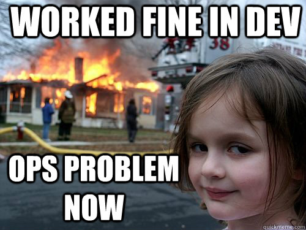
</p>

* And then there is the *time-to-market* factor, where usually it is IT who becomes the *bottleneck* for a new service, or feature, to be implemented in production. The *smoother* the process to go from development to production, the easier and safer it will be to accelerate the deployment of new functionalities.

Wouldn't it be nice to have both teams, Dev and Ops, working together to alleviate these issues and accelerate the introduction of new software capabilities in your applications? Well, that is what [DevOps](https://en.wikipedia.org/wiki/DevOps) is about. DevOps wants both teams to be *equally responsible* for the whole lifecycle of software, so that it becomes easier, faster and safer to deploy.

One of the ideas DevOps promotes is: why can't Ops teams use the same approach to systems as Dev uses for code? Modern development uses [Agile](https://en.wikipedia.org/wiki/Agile_software_development) methodology for software, so why can't we use that also for systems?

And although DevOps has very important cultural concepts on how companies need to change, in this document we will focus on some of the processes, technologies and solutions that DevOps teams could use to improve their daily work.

Let's start at the beginning of everything, where developers... develop.

---

# Development

Sometimes developers work on a common server for a number of individuals, but quite often they might be working in their own workstations or laptops. And of course that local system will be *unique* in terms of installed software, libraries, drivers, kernel, OS, etc. As discussed in the previous section, this will often lead to software that works perfectly in their local system, but does *not* work on a similar system run by a colleague (even another developer with a similar environment).

## Containers and Docker

We would need something that packages and isolates software from the underlying dependencies. Enter [containers](https://en.wikipedia.org/wiki/Linux_containers). And enter their current *de facto* implementation, [Docker](https://www.docker.com/what-docker). We will not go through the specifics of containers in this tutorial, but it would be good for you to review [their website](https://www.docker.com), [this magnificent training](http://container.training/intro-fullday.yml.html), and the following two Learning Labs: [Docker 101](http://learninglabs.cisco.com/lab/docker-101/step/1) and [Docker 201](http://learninglabs.cisco.com/lab/docker-201/step/1), to  get some really nice foundational hands-on experience. Once completed you will have a good understanding of what Docker containers are and how to configure them.

But containers are not only another virtualisation technology. The packaging and portability layer they provide perfectly compliments the needs of modern application architectures based on *microservices*. These are small pieces of software designed to implement a certain subset of functionalities, and interact with other microservices via [APIs](https://en.wikipedia.org/wiki/Application_programming_interface). This is a really powerful approach to software development, as it allows developers to make the most of Cloud native services, and design modular elastic applications that can automatically scale up or down dynamically, based on predefined conditions evaluated in real-time.

It also allows developers to add value while understanding a much smaller part of the overall base code for an application, allowing new members of the team to get upto speed and start contributing more quickly.

On top of that microservices provide fault isolation, so that a failure or bug in one microservice does not affect other parts of the application (other microservices).

## Modern application development with containers

First things first: if you want to understand how *modern* developers work in their own laptops, you will definitely need to install Docker on yours. Please visit [Docker download](https://www.docker.com/get-docker) and get [Docker Community Edition](https://www.docker.com/community-edition). When you are done open a terminal in your laptop (ie. terminal or iterm for Mac, Command Prompt or PowerShell on Windows), and please check that Docker is correctly installed in your system with `docker version`. Finally, go to "Docker Preferences" - "File Sharing", and include the `/Users` directory so that later on we can mount directories from your laptop into Docker container volumes.

Please note that for this document I will use a Mac and [iterm2](https://www.iterm2.com) but you should be able to use any other similar tool and obtain an equivalent output in your own system. For Windows you can use Command Prompt or PowerShell.

Now we need a microservices-based application, but instead of developing one from scratch we will leverage an existing one. And while we are at it we will be able to determine who is the best superhero!

[myhero](http://myhero.imapex.io) is an application developed by [Hank Preston](mailto:hapresto@cisco.com) for demonstration purposes. It is composed by several different microservices, developed in [AngularJS](https://angularjs.org) + [Python](https://www.python.org), and packaged with Docker containers. Basically it allows users to vote for their favorite superhero, and presents the summary results for all received votes.

<p align="center"> 
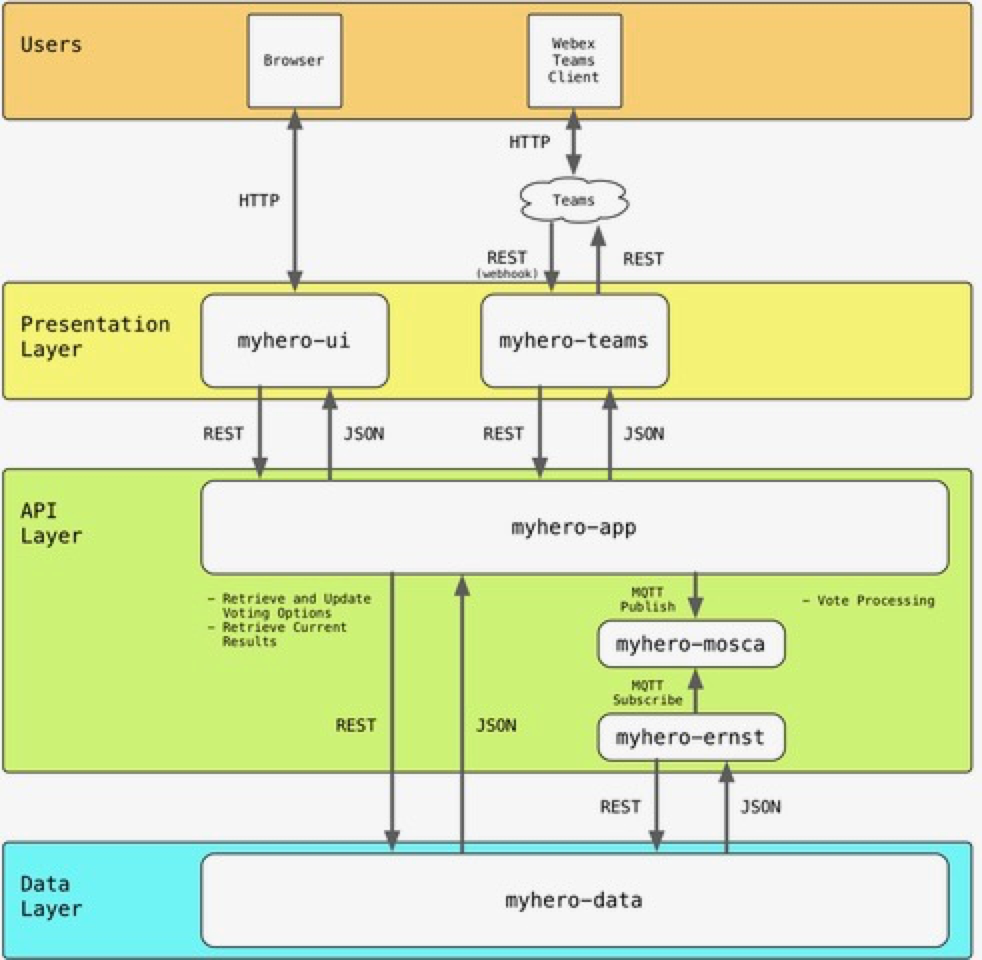
</p>

As the diagram indicates *myhero* has three layers: Data, Applications and Presentation.
* *Data* layer, a microservice composed by a single container that stores the list of available superheros and the number of votes received for each of them.
* *Application* layer, composed by three different microservices. The first and main one is the middleware that processes votes from several user interfaces, and stores them in the Data layer. It includes a variable number of load-balanced containers depending on the needs of the system. The second and third microservices in this layer (*mosca* and *ernst*) are optional, and implement a queueing system to alleviate the pressure when there are multiple votes waiting to be stored in the Data layer.
* *Presentation* layer, composed by several microservices that interact directly with end users. We will use two of them: a Web User Interface for users to vote via a webpage, and a WebEx Teams (previously known as Spark) Interface for users to vote via WebEx Teams (whether from the App or from WebEx Teams website). Each one of these microservices will also be composed by a variable number of load-balanced containers depending on the required load for each of them.

Once you understand the architecture of *myhero* let's get the source code for its three main microservices (*myhero-ui*, *myhero-app* and *myhero-data*) and build a simplified version in our laptop.

<p align="center"> 
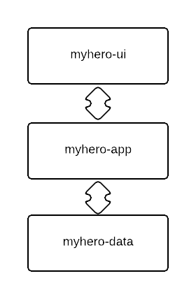
</p>

## Setting your development environment

All the required code to build your *myhero* application is stored in [GitHub](https://github.com), a [repository hosting service](https://en.wikipedia.org/wiki/GitHub) that supports [Git Version Control System](https://en.wikipedia.org/wiki/Git). You can easily [register for a free GitHub account](https://github.com/join), and you will need to [install the Git CLI](https://git-scm.com/book/en/v2/Getting-Started-Installing-Git) in your laptop.

Once installation is complete, go and check that Git is correctly installed in your system by running the following command in a terminal window:

```shell
git version
```

Now create a directory in your user home directory, where you would like to store all DevOps content related to this tutorial and enter it.

```shell
mkdir devops_tutorial
cd devops_tutorial
```

Inside this new directory you will now clone the content from GitHub repositories (aka *repos*) that host all required code for each *myhero* container.

```shell
git clone https://github.com/juliogomez/myhero_ui.git
git clone https://github.com/juliogomez/myhero_app.git
git clone https://github.com/juliogomez/myhero_data.git
```

If you run `ls` now you will find that you have three new directories, one for each repo you cloned.

Please also clone the repo hosting the content of this tutorial, as you will need a number of its files later on:

```shell
git clone https://github.com/juliogomez/devops
```

## Your first container

Let's start with *myhero-data*, so in your terminal run:

```shell
cd myhero_data
```

And then to see its contents:

```shell
ls
```

The *myhero_data/myhero_data* directory stores all the Python code that implements the functionality of this layer. Please feel free to explore it, although it is not required for the purpose of this tutorial.

We are more interested in the *docker-compose.yml* file. While you check its content you might be interested in learning about its [YAML format](https://en.wikipedia.org/wiki/YAML).

Please edit you `docker-compose.yml` and replace the image *name* in *\<name>/\<image>* with your own DockerHub username (if you don't have one you can easily register and get one [here](https://hub.docker.com/)):

```yaml
version: '2'
services:
  myhero-data:
    build: .
    image: <your_DockerHub_user>/myhero-data
    ports:
     - "15000:5000"
    volumes:
     - .:/app/data
    environment:
     -  myhero_data_key=${MYHERO_DATA_KEY}
     -  myhero_data_dir=/app/data/
```

[docker-compose](https://docs.docker.com/compose/overview/) is a tool to define and run Docker applications. It should be included by default in your standard Docker CE laptop installation, and you can check if it is correctly installed in your system by running:

```shell
docker-compose version
```

If is not installed you can always check its [installation page](https://docs.docker.com/compose/install/).

As you can see that *docker-compose.yml* file specifies a number of parameters on how docker should run our *myhero-data* container. It includes a version number (2 for compatibility with further steps later in the tutorial), and then a *services* category where there is a single service defined: *myhero-data*. So basically this YAML file will tell docker how to build and run locally a *myhero-data* container in your laptop.

*myhero-data* service definition in your *docker-compose.yml* file includes several statements:

* *build* specifies how to actually build your own *myhero-data* image (you instantiate an image to create a container), and its value is a simple *"."* (a period). This tells docker-compose it should automatically build the image with the instructions contained in a file located in the *local* directory ("./"). The default name of the local file to use for that build is *Dockerfile* and you will find it in the same directory you are in. We will get back to it soon.
* *image* defines the name of the image to create when building it.
* *ports* defines the required mapping of the port where the container provides its service (for *myhero-data* that is 5000, but this port is only accessible from other containers, not from external systems like our laptop terminal), to the port we want to use in our computer to access that service (in this case port 15000). This way we can access the service provided by this container via calls to `localhost:15000`.
* *volumes* maps a directory in your laptop (in this case the local directory, identified by ".") to a directory inside the container (/app/data in this case). This mapping provides a simple method for data persistency, as all votes will be stored by the container in its */app/data* directory, which is the same as the local directory for *myhero-data* in your laptop. No matter what happens to your *myhero-data* container, your voting data will always be available in your computer. If you kill the container and create a new one, it will still be able to access the same data, so you do not loose any of your votes.
* *environment* defines a couple of variables we want to pass to the container. Why did we not include these values in the code itself, and that way avoid having to define them here? Because there are certain guidelines that we want to follow when developing modern software, things we have learned that work better and provide better results and improved security like in this case. You may learn about them by visiting [12factor](https://12factor.net), and you will see [number III](https://12factor.net/config) talks about how configuration values should be stored in environment variables. This helps us reusing exactly the same code in different environments (ie. dev, qa or prod), but run it differently based on environment variables. It also provides better security as you can upload your software to a public repo without including any confidential secrets or configuration. For example in this case with *myhero-data* you have cloned a public repo with all code, but we will now provide a couple of environment variables. The first one is the private shared *key* ('myhero_data_key') that other containers (like *myhero-app*) should use to interact with it. As long as this container will eventually be running in a public environment you want to make sure that its data are only available to a certain subset of other containers. This shared key provide this kind of authentication. You will see we assign it the value of a variable called *MYHERO_DATA_KEY*, which is defined in the *.env* file also available in your local directory. We have pre-populated that file with a sample key for you to use (check it out and you will see it has a value of *DevData*), but you could modify that *.env* file with your own customised value. You would just need to make sure that other containers use that same value when trying to access *myhero-data* container. For now let's leave it like this. The second environment variable defined in our *docker-compose.yml* file is 'myhero_data_dir' and we have assigned it the name of the directory where we would like the code to store all data. This parameter gives us the flexibility to later on change very easily the location where our container stores its voting data, if we need to.

0k, now that you know about *docker-compose.yml* let's explore that file we saw earlier, *Dockerfile*. As discussed it is a local file in the same *myhero-data* directory that defines how to build the required image instantiated by our container.

```dockerfile
FROM alpine
EXPOSE 5000
MAINTAINER Julio Gomez "jgomez2@cisco.com"

VOLUME ["/app/data"]

# Install python, pip and basic utilities
RUN apk add -U \
        python \
        py-pip \
        ca-certificates \
  && rm -rf /var/cache/apk/* \
  && pip install --no-cache-dir \
          setuptools \
          wheel

ADD . /app
WORKDIR /app
RUN pip install --requirement ./requirements.txt

CMD [ "python", "./myhero_data/myhero_data.py" ]
```

Each one of these lines define a sequential step to create your own image. *FROM* specifies the base image we will use, in this case [Alpine](https://alpinelinux.org/about/) (a minimal Linux image). Then it defines the port to *EXPOSE* by the container (5000) and who is the *MAINTAINER* of this image. *VOLUME* creates a mount point so that it can be used by your host in the *docker-compose.yml* file. Then it *RUN* some installations and cleans the cache to avoid unnecessary data in the image, that could affect its final size. *ADD* copies files from the host local directory to '/app' inside the container, while *WORKDIR* sets the working directory for subsequent commands (like a `cd`). *RUN* installs our pre-defined Python requirements for *myhero-data*, and finally *CMD* executes the command our container will run by default when instantiated.

So when *docker-compose.yml* includes a line that says `build: .` that means docker-compose should look for a file called *Dockerfile* in the local directory, and create an image by running all the steps defined in it.

(Note: as a curiosity you will find a couple of *.txt* files in your *myhero-data* directory. *myhero_options.txt* is the source for superhero options that you can vote, and  *votes.txt* is where the microservice stores all received votes. Not the best database implementation, but perfectly valid for our demonstration.)

Fantastic! Now that you understand this whole process and the interaction between *docker-compose.yml* and *Dockerfile* it is time to actually build the image and run our first *myhero-data* container. 

The good thing is that everything is ready for you, so you just need to run...

```shell
docker-compose up
```

... and that will trigger the following process:

* *docker-compose* will first build the image, so it will go to your Dockerfile and download the required *alpine* image to use as the baseline. You might suddenly wonder where does it download it from... and that would be a very valid question! By default *docker-compose* will download images from Docker's own public registry service for image repository, [DockerHub](https://hub.docker.com). There are several other options but this one is convenient for our setup.
* Then it will instantiate the image to create a running container with the required port mapping, volume mapping and use of the provided environment variables.

You will notice that once you run `docker-compose up` your terminal will not accept any further input from your keyboard, while displaying the output of the whole process of creation and execution, and later *myhero-data* container logging itself. Let's leave it like that and **open a new terminal** to continue our work, while *myhero-data* is still active in the first one.

In that new terminal window you may check the status of your container is *Up* by running:

```shell
docker ps
```

```console
CONTAINER ID        IMAGE                    COMMAND                  CREATED             STATUS              PORTS                     NAMES
f7a2117df5df        myherodata_myhero-data   "python ./myhero_dat…"   25 minutes ago      Up 25 minutes       0.0.0.0:15000->5000/tcp   myherodata_myhero-data_1
```

As long as we are creating a multi-layer, multi-microservice, multi-container architecture, we have just initiated one of them (*myhero-data*) but not any others. In a few minutes we will follow the same process for other containers, but before doing that let's verify that our *myhero-data* container is working fine.

You might remember we discussed at the beginning of this document that microservices interact via APIs. Specifically these are [RESTful](https://en.wikipedia.org/wiki/Representational_state_transfer) APIs, which provide a uniform and small predefined set of stateless operations (methods) accessible via HTTP URLs. The main benefits this provides is that these are truly loosely coupled APIs (service implementation can change along time without disruption) and they are language-agnostic.

It is easier to understand with an example, so let's interact with our *myhero-data* container via its RESTful API. As you probably remember the container exposed its service in port 5000, but container ports are only accessible from other containers, not from systems external to the container environment like our laptop terminal. So that is why we mapped *myhero-data* port 5000 to port 15000 in our laptop. That way we can access *myhero-data* via `localhost:15000` from our terminal.

So let's go ahead and emulate an API call to our *myhero-data* container and see if it answers correctly. From your second terminal window run:

```json
curl -X GET -H "key: DevData" http://localhost:15000/options

{
    "options": [
        "Captain Cloud",
        "Spider-Man",
        "Captain America",
        "Batman",
        "Superman",
        "Wonder Woman",
        "Deadpool",
        "Black Widow",
        "Iron Man",
        "Star-Lord",
        "Scarlet Witch",
        "Gamora"
    ]
}
```

You should get a [JSON](https://en.wikipedia.org/wiki/JSON) file with a list of all the different superheros users can vote for. JSON is a very common format used in browser-to-webserver asynchronous communications.

[curl](https://curl.haxx.se) is a CLI tool to transfer data with URLs, so it allows us to emulate RESTful API calls to our containers. In this case we use it with `-X` to define a custom request method that will eliminate unnecessary information from the answer message. `GET` will request the specified page and receive the document it asked for. `-H` will include an extra header, in this case specifically the shared private key required to interact with the container. This key is the one we defined in the *docker-compose.yml* and *.env* files. And finally the URL to access the service, formed by `localhost:15000` to access the mapped port inside the container. We append `/options` to define the path of the action we would like to perform (obtain the superhero options users can vote for).

You can use *curl* for additional tasks, like voting (using the POST method instead of GET):

```json
curl -X POST -H "key: DevData" http://localhost:15000/vote/Deadpool

{
  "result": "1"
}
```

You can also review the summary results for all votes (GET method again):

```json
curl -X GET -H "key: DevData" http://localhost:15000/results

{
  "Captain Cloud": 1,
  "Deadpool": 1
}
```

Congratulations, you just built, ran and tested your first container in your own laptop!

## Building a complete microservices-based application

For our local environment we will build a simplified version of *myhero* with just 3 containers: *myhero-data*, *myhero-app* and *myhero-ui*.

<p align="center"> 

</p>

We have *myhero-data* already working in our laptop, so let's now follow the same process for *myhero-app* and *myhero-ui*. As long as this will be a very similar process to the steps already described earlier in the document, I will focus on the specifics that might be different for new containers.

Let's go with *myhero-app*. Please go to the directory where you cloned your *myhero-app* source code from GitHub: 

```shell
cd devops_tutorial/myhero-app
```

Inside it you will find a very similar structure to the one you already know from your previous review of *myhero-data*. You will find all the Python code for this container inside *myhero-app/myhero-app*. Feel free to explore it if you are familiar with Python.

There you will also find a *docker-compose.yml* file, and its content should now be familiar to you. Of course port mapping uses a different port in our laptop (15001), but the same one in the container (5000). We need to provide different ports in our laptop, so that each individual service is accessible via its own port. And both containers may offer their service in the same port (5000) because they are  independent entities inside the container engine.

In terms of  environment variables you will find three of them. The first one is the private key shared with *myhero-data*. In case we changed it for *myhero-data* we would also need to change it in the local `.env` file, so that they could communicate properly. If you did not change it then it is fine to leave this one as is. Then you have the second one, similar to the previous variable, but called *myhero_app_key*. It will also be used in a similar way, but instead of validating the communication between *myhero-data* and *myhero-app*, it will validate the communication between any User Interface service (like *myhero-ui*) and *myhero-app*. The third environment variable is *myhero_data_server* and it provides the complete URL (service name and port) required to reach *myhero-data*.

Something new in this *docker-compose.yml* is the definition of a default *network*. The reason we need to define one for *myhero-app* is that by default every `docker-compose up` command will generate its own network. So by default there would be no communication between containers defined in different *docker-compose.yml* files, like in our case. So the solution is to let the first container (*myhero-data*) create its own network, and then have subsequent ones (*myhero-app* and *myhero-ui*) reuse that network. That is what the new *networks* section in *myhero-app* is doing, defining a default network that reuses the existing one from *myhero-data*.

With regard to the Dockerfile it follows exactly the same structure as the previous one we reviewed, so nothing to remark there.

Let's get it up now! Just run it in the same way as you did before and you will get a very similar result.

```shell
docker-compose up
```

We can communicate with *myhero-app* in the same way, and ask it for the same list of options to vote. The *big* difference is that *myhero-app* does not have that information, as it is stored in *myhero-data*, so it will have to request it by itself. Please **open a new terminal window** (that would be third one) and let's see it working:

```shell
curl -X GET -H "key: DevApp" http://localhost:15001/options
```

And the same as we did with *myhero-data*, you can do additional tasks like voting:

```shell
curl -X POST -H "key: DevApp" http://localhost:15001/vote/Superman
```

Or getting the results (please note the */v2/*, as the initial voting specification was deprecated):

```json
curl -X GET -H "key: DevApp" http://localhost:15001/v2/results

{
  "Captain Cloud": 1,
  "Deadpool": 1,
  "Superman": 1
}
```

It works!

As you can see we have had to use *DevApp* instead of *DevData*, because we are interacting with *myhero-app* instead of *myhero-data*, and as per our configuration they have different shared private keys.

So just to make it clear once again, from our laptop terminal we are requesting the voting options to *myhero-app* and, as long as that information is in a different container, *myhero-app* is requesting *myhero-data* to provide it. *myhero-data* returns the JSON file to *myhero-app*, and *myhero-app* forwards it to our terminal.

Nice, let's now do the same for the third and last of our containers, *myhero-ui*.

Please go to its own directory where you cloned the content from the repo in GitHub:

```shell
cd devops_tutorial/myhero_ui
```

There you will see a very similar file and directory structure, only in this case the code is stored in a folder called *app*. If you take a look inside you will realize there is no Python code in there. As long as this UI is a webpage, it has been developed in AngularJS. We will discuss an important implication of this in a minute.

For now let's just review the *docker-compose.yml* file, and this time it should be *really* familiar to you. It just maps a different port in your laptop (15080) to port 80 in the container (80 is the default port for web servers like this UI frontpage). And then you have your environment variables. Something that might catch your attention is that they define the *app_server* and *spark_server* by referring to *localhost:laptop_port* instead of *container_name:container_port*.

This is a consequence of the way AngularJS works. If you are not familiar with this programming language that is 0k, but you will need to understand this important implication. Services implemented as AngularJS applications run *client-side*. That means that the only interaction from the browser to the web server is to download HTML, CSS, images and JavaScript code. All the actual logic and code running happens client-side, in the browser itself. This is really important for our application, because *myhero-ui* will be that webserver providing our laptop's browser with everything it needs. And then the browser will access directly *myhero-app*. That is why we need to provide an externally accessible address of our *myhero-app* container, in the form of an environment variable.

<p align="center"> 
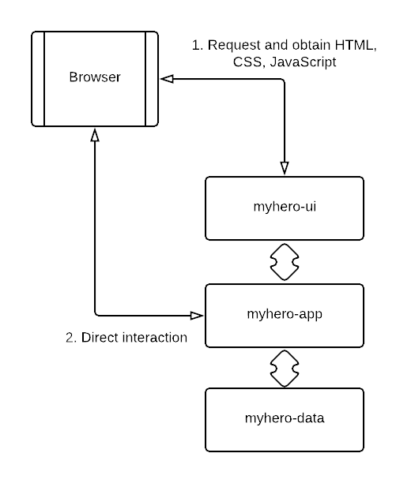
</p>

As for the Dockerfile you will see that the image is based on [nginx](https://www.nginx.com), a very frequently used webserver image that does many other things on top of that.

Let's run our User Interface container now, with the usual command:

```shell
docker-compose up
```

Now you are able to access your *myhero-ui* container, but instead of using `curl` for it, you can point your browser directly to `http://localhost:15080`, and *voilà*!

<p align="center"> 
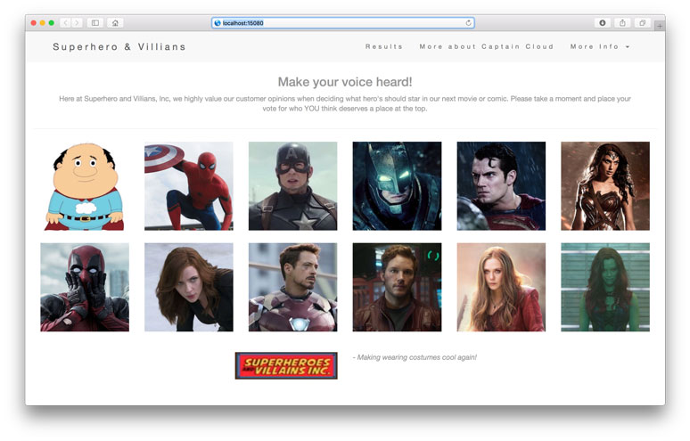
</p>

Please note that if you click on *Results* you will see every vote, including the ones you provided directly via `curl` to *myhero-data* and *myhero-app* in previous steps.

Congrats, you are now running your first microservices-based application!

## Working on your code

Now that everything is working let's see how you can make changes to the code in your containers. We will use *myhero-ui* for this section, because it will be easier to see changes to the Web interface by just reloading the webpage in our browser.

**Open a new terminal** (that would be the fourth one) and go to *myhero-ui* directory:

```shell
cd devops_tutorial/myhero_ui
```

The *app* directory is where code resides. You will find there the whole directory structure and all files required for our web frontend to run. Feel free to explore it, and when you are ready let's edit, for example, the file that defines the main webpage:

```shell
vi ./app/views/main.html
```

In the second line you will find a line that says:

```html
<h3>Make your voice heard!</h3>
```

Modify it by swapping *heard* to *HEARD*, and including more exclamation marks:

```html
<h3>Make your voice HEARD!!!</h3>
```

Save it and refresh your browser (ie. shift+refresh in Safari). Changes are not reflected... why? Well, because when you created the *myhero-ui* image your container is currently running, its Dockerfile copied all code **available at that point in time** from your laptop directory into the image. And then your container instantiated from *that* image, and obviously with *that* code. If we want to use our *new* code we have to rebuild our *myhero-ui* image and then instantiate a new container from that new image.

Before creating the new *myhero-ui*, please stop the old one. Go to your previous terminal window (the third one you opened) and press *ctrl+c* to stop the running container.

Now go back to the fourth terminal window and run:

```shell
docker-compose up --build
```

If you do a hard refresh in your browser (ie. shift+refresh in Safari) you will see your updated web page!

As you can see, using a single command you can test new code in any of your containers!

Most developers working on real projects will not use a rudimentary editor like `vi`, but an [IDE](https://en.wikipedia.org/wiki/Integrated_development_environment) (Integrated Development Environment). There are multiple options available, like [Visual Studio Code](https://code.visualstudio.com), [Atom](https://atom.io), [PyCharm](https://www.jetbrains.com/pycharm/) or [Sublime Text](https://www.sublimetext.com). You can test all of them for free and see which one fits better your preferences and needs.

## May I use WebEx Teams to vote?

Voting through a website is nice and convenient, but today's world offers a myriad of different devices and solutions to interact with: mobile phones, tables, wearables, etc. We would like to offer our users with additional ways to vote for their favorite superhero.

[Cisco WebEx Teams](https://www.webex.com/products/teams/index.html) (soon to become Webex Meetings) is a collaboration tool that supports *rooms* where users can interact (voice, video, IM) and share documents. Additionally it supports *bots* that you can interact with. It is an ideal platform to implement a service that allows our users to vote.

<p align="center"> 
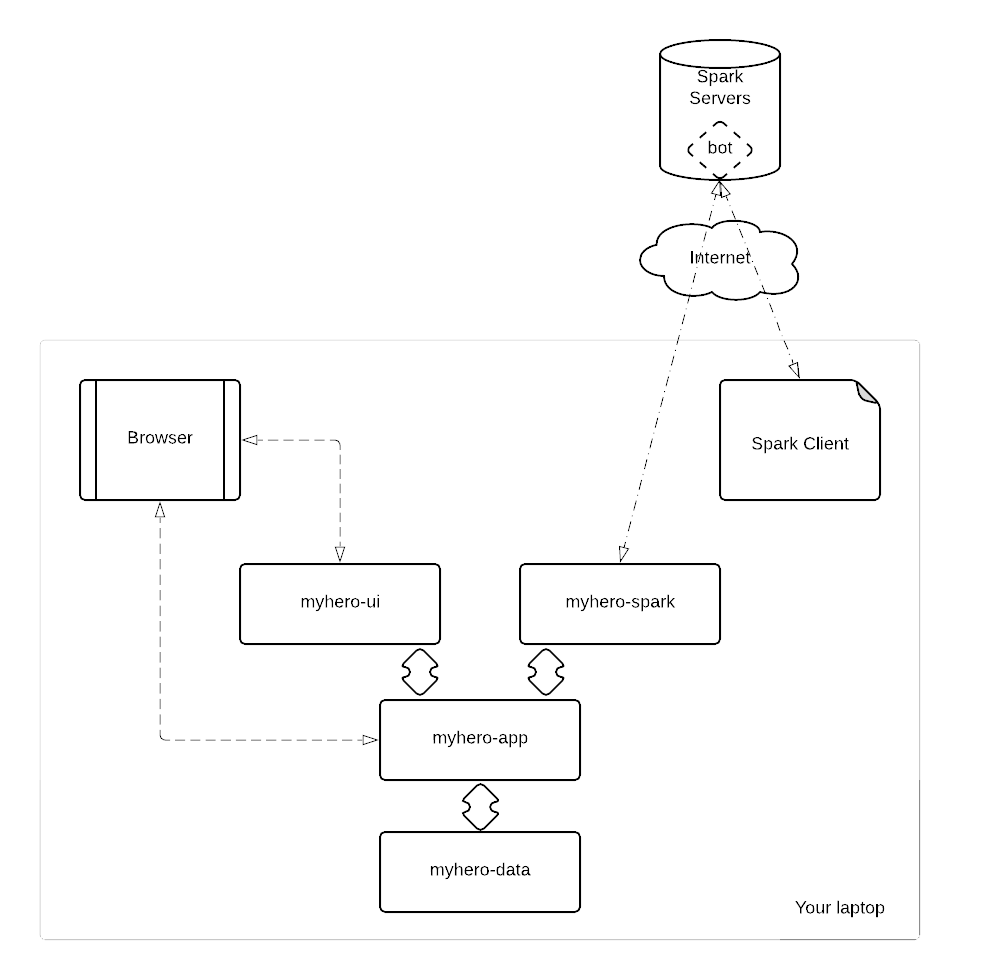
</p>

Please go ahead and register for a WebEx Teams account, it is easy and completely free. You can use WebEx Teams from an app installed in your computer/laptop/mobile, or via a web interface.

Once you are set we will need to create a *bot* for our *myhero* app. Don't worry, it is easy. Please visit [WebEx Teams for Developers](https://developer.webex.com) and login with your WebEx Teams user. Then go to *My Apps* and click on the **+** sign to add a new *App*. Click on *Create a Bot* and give it a *Name* you like. Then create its address by providing a *Bot Username* (@webex.bot). Choose your favorite icon and add a short description about your bot. Then click on *Create Bot*. On successful creation you will see all info about your bot, please make sure to copy and save your *Bot's Access Token* (long string of characters), as you will need it later on and you will not be able to come back to review it. Your bot is now ready!

However your bot does not know yet how to interact with users that want to vote. Let's provide it with the required code to implement this functionality.

Open yet another terminal window (that would be the fifth one) and go into the right directory:

```shell
cd devops_tutorial
```

Please download the source code to create the WebEx Teams microservice that will allow your WebEx Teams bot interact with users and the WebEx Teams servers.

```shell
git clone https://github.com/juliogomez/myhero_spark.git
```

Go into *myhero-spark* directory:

```shell
cd myhero-spark
```

And review the usual *docker-compose.yml*, *Dockerfile* and *.env* files. The main difference you will notice in the *docker-compose.yml* file is that there are a number of variables to use for this container to run. Apart from the shared private *app-key* to communicate with *myhero-app*, and the *app-server* address, there are a number of WebEx Teams variables.

* *bot_secret* is the shared private key to communicate with our *myhero-spark* microservice.
* *bot_email* is the address of the bot you created (ie. yourbot@webex.bot).
* *token* is the long string of characters you obtained when you created your bot (the one you saved).
* *bot_url* is the **public** URL where Cisco WebEx Teams servers can find your bot. This is required so that WebEx Teams servers redirect messages from WebEx Teams users to the microservice running in your laptop for processing. But think about it... you are deploying *myhero* microservices in your own laptop, which probably resides in a private environment (home or office) with connectivity to the outside world via a gateway. So if it is not reachable from Internet, WebEx Teams servers will not be able to access your *myhero-spark* container.

We can easily overcome this challenge by using a CLI tool called [ngrok](https://ngrok.com). 

<p align="center"> 
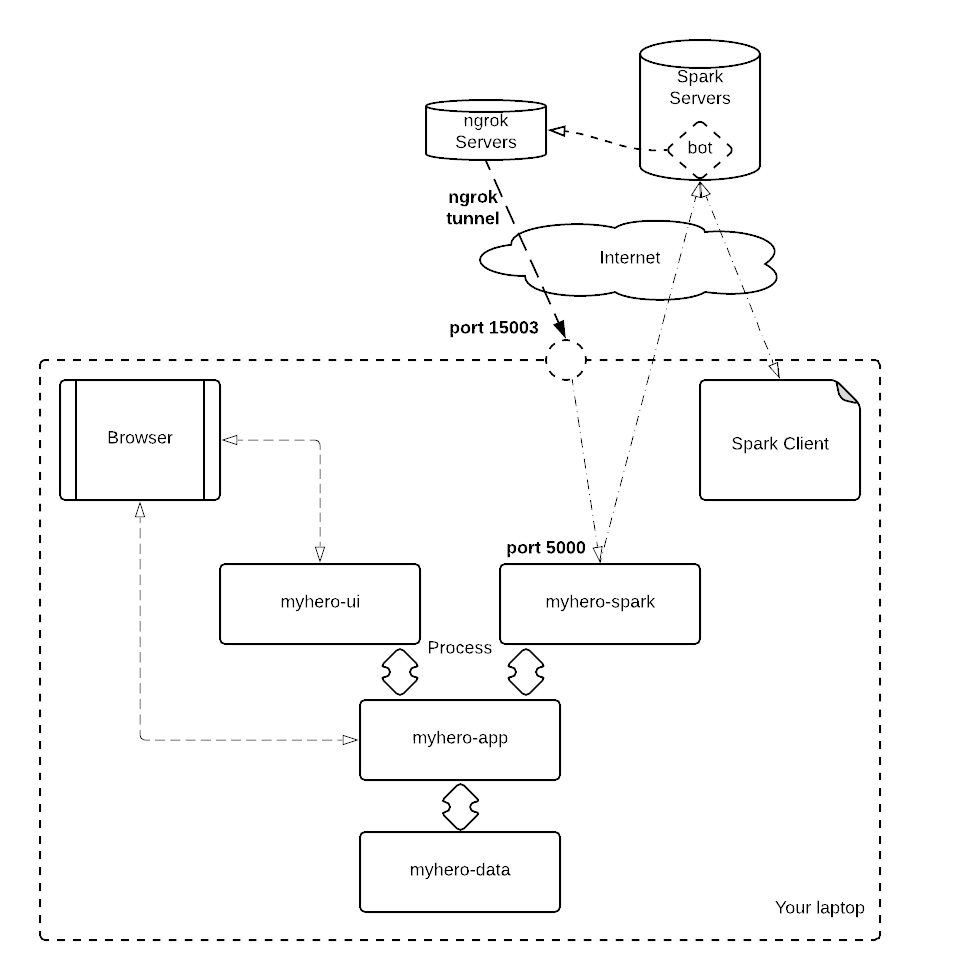
</p>

You just need to [download ngrok](ngrok.com/download) and install it in your laptop. Then from you terminal window run:

```shell
ngrok http 15003
```

As per *myhero-spark* *docker-compose.yml* file, this is the port where you will run the *myhero-spark* container. Copy the resulting 'http://xxxxxxxx.ngrok.io' you will find under 'Forwarding', save it and let *ngrok* run in that terminal window.

Now you can **open a new terminal** (the sixth one) and go to your *myhero_spark* directory again.

```shell
cd devops_tutorial/myhero-spark
```

Check its content, including hidden files:

```shell
ls -lart
```

And you will find a '*.env.template*' file. Rename it to '*.env*' with:

```shell
mv .env.template .env
```

Edit the '*.env*' file to include all empty required values, including the *ngrok* URL you saved as the value for *NGROK_URL*.

You can now run:

```shell
docker-compose up
```

See *myhero-spark* image being built and a container instantiate based on it. Let it run there.

**Open a new terminal** (seventh one) and now you can ask your *myhero-spark* container to invite your WebEx Teams user to vote. Run:

```shell
curl http://<ngrok_url>/hello/<your_WebEx_Teams_email>
```

You will automatically get a new message in your WebEx Teams application, asking if you would like to vote. Any answer you provide will make the bot respond with the set of commands accepted by the bot. You can see the available options with "/options", vote with "/vote" and the name of a superhero, and see the results with "/results".

As long as this is just another interface available to your users, it relies on the same *myhero-app* and *myhero-data* containers as before. So you will still see the votes you put in the system via the web interface. And any vote you put in via WebEx Teams, will also be reflected in the web interface results.

Congratulations, you just implemented another microservice to provide an additional interface for your users to vote!

## How to publish your images

Now that your containers are working it would be a good moment to publish the images they are based on. You just built them and they are ready to be shared with colleagues so that they can enjoy *myhero* too!

Before publishing them you will need to create a [DockerHub](https://hub.docker.com) account. It is simple and free, and it will allow you publish your images easily.

Find out the names of your existing images by filtering the ones that contain *myhero*:

```shell
docker image ls | grep myhero
```

Login into DockerHub with `docker login` and provide your username and password. Once done you will be able to push your images (please remember to replace the *name* in \<name>/\<image> with your own DockerHub username):

```shell
docker push <your_DockerHub_username>/myhero-data
docker push <your_DockerHub_username>/myhero-app
docker push <your_DockerHub_username>/myhero-ui
docker push <your_DockerHub_username>/myhero-spark
```

<p align="center"> 
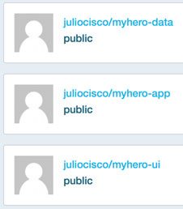
</p>

Once completed everybody will be able to use those images and download them immediately by simply including them in their projects with the names you specified.

## Microservices management

When you are finished testing your new application please press Ctrl+C in each terminal to stop *myhero-data*, *myhere-app*, *myhero-ui* and *myhero-spark* containers. You may check they are not running anymore with:

```shell
docker ps
```

As you already know (if you followed the Docker tutorials referenced before) you can see *exited* containers with:

```shell
docker ps -a
```

(-a for *all*)

You can delete individual containers from your system with:

```shell
docker rm -f <container_id>
```

or

```shell
docker rm -f <container_name>
```

You might even delete *every* container in your system with a single command:

```shell
docker rm -f $(docker ps -aq)
```

Don't forget to stop *ngrok* as well, by pressing Ctrl+C in its own terminal window (the fifth one).

---

# Operations

Once developers feel comfortable with code running in their laptops they need to start thinking about how it will go into production. That production environment might be on-premises (private) or in the Cloud (public), depending on many different factors, like cost, data confidentiality or even local country regulations.

## On-premises deployment

On-prem might be, for example, a QA (Quality Assurance) environment where code is tested (unit testing). And only on successful completion it would be moved to production (whether on-prem as well, or in the Cloud). Or the other way around... There are multiple possible scenarios and it would be great that they were kind of similar, right?

In any case on-prem environments are very common and they provide total flexibility as they are run by in-company personnel. Of course they come at a cost in terms of purchasing and operating the solution, but the knowledge obtained in the process will allow you to understand and optimize many aspects that will be of ultimate benefit for you, your software and your company.

Don't worry if you have no hardware at all to build your own datacenter. There are several alternatives that might be of interest to you to start learning:

* [Katacoda kubernetes playground](http://katacoda.com/courses/kubernetes/playground): very basic k8s cluster with just 1 master + 1 worker nodes, pre-configured, accessible via web-based terminal, and valid for quick tests, as the environment is very short-lived (5-10 mins).
* [play-with-kubernetes](https://labs.play-with-k8s.com/): basic k8s cluster with multiple Docker-based nodes ([Docker in Docker](https://hub.docker.com/_/docker/)), you need to initialize all different nodes and required networking yourself, accessible via web-based terminal, short-lived (4-hours).
* [DevNet k8s sandbox](http://cs.co/SBxK8sContiv): comprehensive environment with 1 master + 3 worker nodes, based on VMs, pre-configured, accessible via SSH, valid for long testing (multi-day reservations) and reliable. It includes other interesting features, like Contiv for networking.

### No hardware for you?

But wouldn't it be great to have your own on-prem datacenter, where you could install all required components to deploy your recently-created microservices application?

Of course the main problem is what would be cost for the required number of servers, switches, power supplies, cabling, etc? Even power consumption would be significant if you deploy something like that at home. Not even mentioning that would be a noisy and cozy room, so maybe your family would not be *that* happy about this project of yours.

The solution would be to have a *mini* DataCenter with the following features:
* Cheap
* Small form-factor
* Easy to find components
* Easy to build
* Low power consumption
* Silent
* Transportable (to take it with you on holiday)

With those requirements I built this:

<p align="center"> 
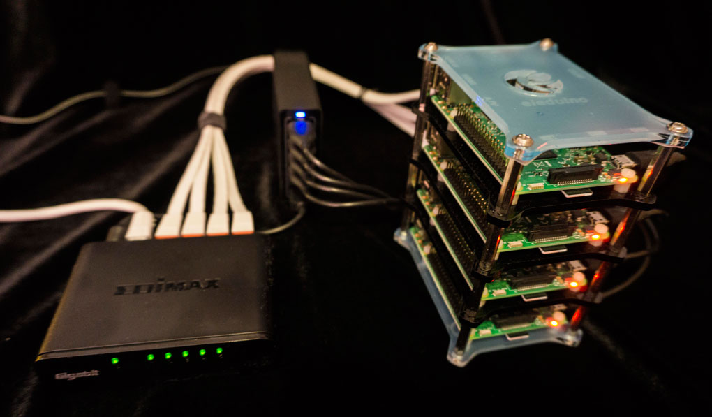
</p>

Maybe that single photo does not accurately reflect the *real* size format of our mini DataCenter, so let's add a banana for scale.

<p align="center"> 

</p>

It **IS** really small!

### MiniDC features

You may find below the shopping list I used:
* 4x Raspberry Pi
* 4x microSD cards
* 1x microSD to SD adapter
* 1x USB-powered 5-port switch
* 4x Eth cables
* 1x 5-port USB power hub
* 4x microUSB-to-USB power cords
* 1x RPi Case for 4x RPi

For less than $300 you are all set to build a tiny and quiet, but fully-functional, 4-server datacenter. I chose 4 servers because I wanted to deploy a Kubernetes cluster with 1x Master and 3x Worker nodes, but you could have something different, like 3 or 6 nodes. I got all components from a single source (ie. Amazon, [here](http://amzn.eu/29EpwDv) is my shopping list), quickly shipped home to start working on it asap. Easy.

### How to build your own cluster

From the hardware perspective it is quite straight-forward, as you only need to mount the RPi boards on the case, connect all power cables to the power supply, and Ethernet cables to the switch. That's it.

Now for the software we need to run a number of tasks, some of them on all nodes but some of them only on certain ones, so please pay attention to the following instructions. Many thanks to [Carlos](https://twitter.com/carlosedp) for his guidance on k8s over ARM.

**For all nodes**

* Flash the microSD card with a Raspbian image. You may go [here](https://downloads.raspberrypi.org/raspbian_lite/images/) and download the latest version. Then download [Etcher](https://etcher.io/), install it in your laptop and flash your card with the Raspbian image you just downloaded. As long as SSH is disabled by default you would not be able to access your RPi unless you used a USB keyboard and HDMI monitor. Luckily there is a workaround in case you do not have any of these: once your card is flashed, access it from a terminal window and create an empty file called *ssh (in Mac you may just run `touch ssh` from your terminal). This will allow you to run a *headless* install (without terminal and keyboard) of your RPi. Insert the microSD card in the RPi and power it. Connect your laptop to a port in the switch and run: 

  ```shell
  ssh pi@raspberry.local
  ```

  (default password is *raspberry*)

  You are in!

* Now you need to do some basic configuration on your RPi.

  ```shell
  sudo raspi-config
  ```

  You will access its configuration menu. There you will need to change the default password. Then under *network options* change *hostname* for each RPi board to 'master', 'worker-01', 'worker-02' and 'worker-03'. Under localisation options change locale to your preferred value (ie. en_GB.UTF-8). Select your *timezone*, *keyboard configuration*, and change your *WiFi country*. Under *interfacing options* enable SSH access. Under *advanced options* expand your filesystem so that the whole microSD card is used by the system. You may now finish. There are a couple of locale variables that are not automatically set, so please run: 
  
  ```shell
  sudo vi /etc/default/locale
  ```

  and add the following lines:

  ```console
  LANGUAGE=en_GB.UTF-8
  LC_ALL=en_GB.UTF-8
  ```

* Create a script to set the hostname, IP address and DNS server:

  ```shell
  vi hostname_and_ip.sh
  ```

  and insert the following content:

```shell
#!/bin/sh

hostname=$1
ip=$2 # should be of format: 192.168.1.100
dns=$3 # should be of format: 192.168.1.1

# Change the hostname
sudo hostnamectl --transient set-hostname $hostname
sudo hostnamectl --static set-hostname $hostname
sudo hostnamectl --pretty set-hostname $hostname
sudo sed -i s/raspberrypi/$hostname/g /etc/hosts

# Set the static ip

sudo cat <<EOT >> /etc/dhcpcd.conf
interface eth0
static ip_address=$ip/24
static routers=$dns
static domain_name_servers=8.8.8.8
EOT
```

* Run the following script:

  ```shell
  ./hostname_and_ip.sh <hostname> <IP> <default_GW>
  ```

  *hostname* should be *master*, *worker-01*, *worker-02* an *worker-03*, respectively in each node. *IP* should be the static IP address you want to use in RPi Ethernet port, and should be part of the subnetwork configured in your home router LAN segment (usually 192.168.1.1/24). Configure your home router DHCP server to assign IPs only from a limited block. For example DHCP could provide addresses up to 192.168.1.99, and then you could use 192.168.1.100-103 for your servers static IP addresses. Please use the IP of your home router in the LAN segment (usually 192.168.1.1) as *default_GW*.

* Reboot your system:

  ```shell
  sudo reboot
  ```

* Create another script to install Docker, add Kubernetes repo, disable swap memory and install *kubeadm*:

  ```shell
  vi init.sh
  ```

  and insert the following content:

  ```shell
  #!/bin/sh

  # Install Docker
  curl -sSL get.docker.com | sh && \
    sudo usermod pi -aG docker

  # Disable Swap
  sudo dphys-swapfile swapoff && \
    sudo dphys-swapfile uninstall && \
    sudo update-rc.d dphys-swapfile remove
  echo Adding " cgroup_enable=cpuset cgroup_enable=memory" to /boot/cmdline.txt
  sudo cp /boot/cmdline.txt /boot/cmdline_backup.txt
  # if you encounter problems, try changing cgroup_memory=1 to cgroup_enable=memory.
  orig="$(head -n1 /boot/cmdline.txt) cgroup_enable=cpuset cgroup_memory=1"
  echo $orig | sudo tee /boot/cmdline.txt

  # Add repo list and install kubeadm
  curl -s https://packages.cloud.google.com/apt/doc/apt-key.gpg | sudo apt-key add - && \
    echo "deb http://apt.kubernetes.io/ kubernetes-xenial main" | sudo tee /etc/apt/sources.list.d/kubernetes.list && \
    sudo apt-get update -q && \
    sudo apt-get install -qy kubeadm
  ```

* Grant user *pi* the right permissions to run *docker* commands:

  ```shell
  sudo usermod -aG docker pi
  ```

* Reboot your system:

  ```shell
  sudo reboot
  ```

**Only on the MASTER node**

* Create a configuration file to change the time required to reschedule a pod from a lost node to 10s (*pod-eviction-timeout*), and also to change the time a node can be unresponsive to 10s (*node-monitor-grace-period*)

  ```shell
  vi kubeadm_conf.yaml
  ```

  and insert the following content:

  ```yaml
  apiVersion: kubeadm.k8s.io/v1alpha1
  kind: MasterConfiguration
  controllerManagerExtraArgs:
    pod-eviction-timeout: 10s
    node-monitor-grace-period: 10s
  ```

* Initialize kubernetes with:

  ```shell
  sudo kubeadm init --config kubeadm_conf.yaml
  ```

  (please copy the resulting "*kubeadm join ...*" message in your laptop, so you can use it in your *worker* nodes later)

* Once completed follow the instructions on the screen and run:

  ```shell
  mkdir -p $HOME/.kube
  sudo cp -i /etc/kubernetes/admin.conf $HOME/.kube/config
  sudo chown $(id -u):$(id -g) $HOME/.kube/config
  ```

* Check that your node now shows up in:

  ```shell
  kubectl get nodes
  ```

* By default Kubernetes does not include any networking solution, so you have the flexibility to install your preferred one. A simple one to use is Weave, and you can install it easily:

  ```shell
  kubectl apply -f https://git.io/weave-kube-1.6
  ```

**Only on WORKER nodes**

* Configure your *worker* nodes to join the Kubernetes cluster with the output you obtained from the *master* node and saved in your laptop:

  ```shell
  sudo kubeadm join ...
  ```

Once you have done all of this please go back to your master node and check that all your 4 nodes show up as `ready`:

```shell
kubectl get nodes
```

You should also check that the configuration file was correctly accepted:

```shell
kubectl describe pod kube-controller-manager-master -n kube-system
```

Congrats, your Kubernetes cluster is now all set!

### External connectivity

Your MiniDC resides in a local environment, which might be good enough for your testing. Basically your servers can access the Internet via the default gateway (your home router) but they cannot be reached from the outside world.

<p align="center"> 
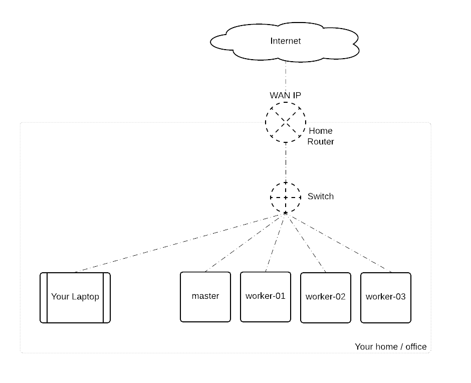
</p>

But what if you (or a colleague) need to access your MiniDC from outside your home? We need to work on a solution that enables external connectivity to your setup.

Your connection to the outside world is your home router. It is the only one with a *public* IP address in its WAN interface, so it is the only one *known* (routable) to the Internet. Everything inside your home LAN segment uses private IP addresses that cannot be reached from outside. So we need to work with that one and only public IP address for everything we need.

You can find out the actual WAN IP address of your home router by running the following command from your laptop.

```shell
dig +short myip.opendns.com @resolver1.opendns.com
```

The first challenge we find is that a home router WAN IP address can change along time, it is *dynamic*. Your ISP policy might refresh them periodically, or under periods of inactivity, etc. That leads to the fact that your router's public IP address will not always be the same. Relying on that IP to connect to your setup means that eventually you might loose connectivity, so we need a way to make IP changes transparent to us. In order to accomplish this we will use [Dynamic DNS](https://en.wikipedia.org/wiki/Dynamic_DNS).

DDNS is based on the idea that one of your local systems (whether your router or any other system inside your LAN) will periodically report back to your DDNS service signalling what is your current public IP address. When your ISP changes it your local system will report it to DDNS. This way DDNS will always know what is the most current IP address for your router.

There are multiple DDNS providers, and you can choose the one you prefer. For this tutorial we will demonstrate [NoIP](https://www.noip.com), that gives you 3 hostnames for free and can easily integrate with RPi.

<p align="center"> 
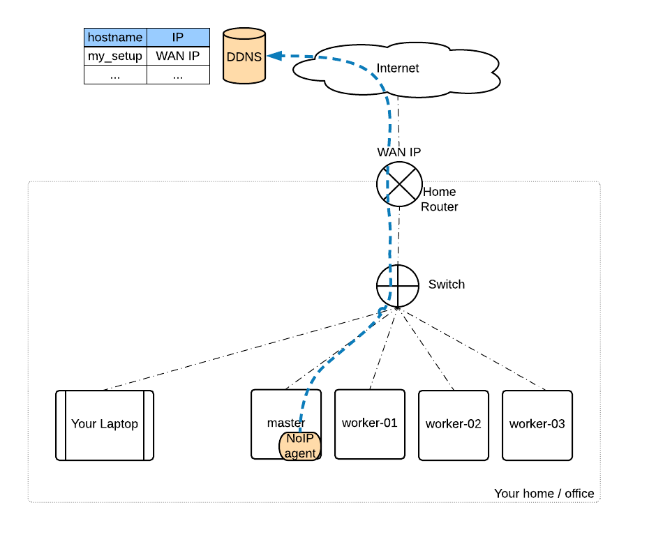
</p>

So you can register and create a hostname of your choice, and that will be mapped to the WAN IP address of your router.

Once done you will need to install the NoIP agent in one of your local systems. Maybe your router could support it, but there are so many models it would be impossible to cover a generic way to do it. You could install it in your own laptop, but probably that is not always on. So the best option is to install it in one of your RPi.

Let's install it in our RPi *master* node, by following the instructions [here](https://www.noip.com/support/knowledgebase/install-ip-duc-onto-raspberry-pi/).

Note: if the final `/usr/local/bin/noip2 -S` gives you an error message it might be a permissions issue, so just run the following commands:

```shell
sudo chmod a+rwX /usr/local/etc/no-ip2.conf
sudo /usr/local/bin/noip2
```

Check again to make sure everything is 0k now.

```shell
sudo /usr/local/bin/noip2 -S
```

Make sure your DDNS entry is correctly associated to your home router WAN IP address.

```shell
dig <hostname> @8.8.8.8 +short
```

By now DDNS should be able to resolve your newly created hostname to the public IP address of your home router.

**First challenge solved!**

The second challenge is how to get from your WAN router interface to your RPi boards. For that you might use different home router features, but we will use *virtual servers* for this tutorial. The idea is to map all traffic going to a combination of your WAN IP address **and** a specific port (*<WAN_IP>:\<port>*), towards a certain combination of private IP address in your LAN segment and destination port. In the example below you can see I am redirecting all traffic coming to my home router WAN IP address and port 22400, towards 192.168.1.100 (LAN IP address of my *master* node) port 22 (SSH).

<p align="center"> 
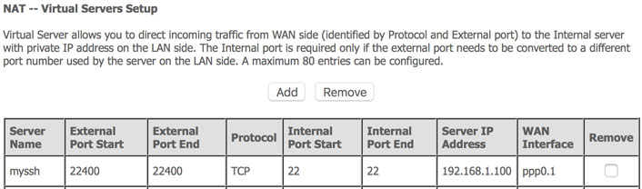
</p>

This way I can run `ssh pi@<hostname>:22400` from anywhere in the Internet and access my RPi *master* node. How cool is that?

<p align="center"> 
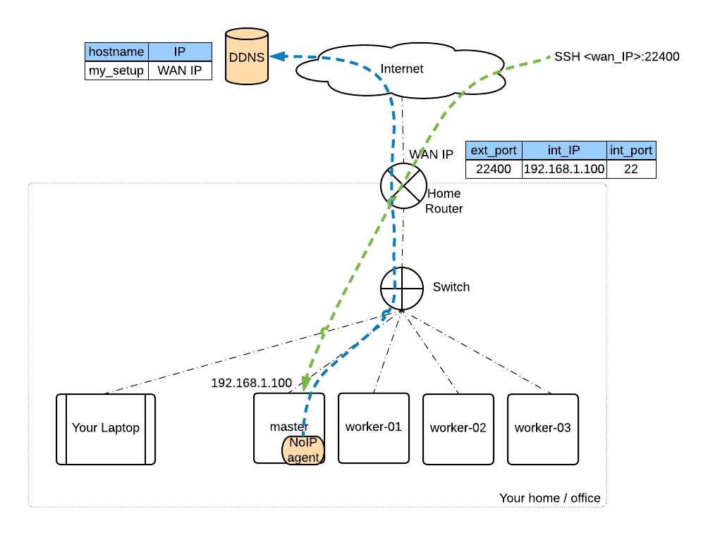
</p>

This is an important foundational feature we will use extensively later in our MiniDC setup.

**Comment 1**: if you use [OpenDNS](https://www.opendns.com), or a similar service, you might see your DDNS+virtual_server setup fail. Why is that? The reason is OpenDNS algorithms identify dangerous domains based on malicious activity associated to them. As you can imagine dynamic DNS entries are very frequently used for this type of activities, so OpenDNS redirect your DNS resolution to a *sinkhole*. This means that they will not resolve your hostname to your home router WAN IP address, but to a certain IP that will not work for you. How can we workaround this for our *well-behaved* setup? We just need to ask a *different* DNS  how it resolves our DDNS hostname. For example you may ask Google DNS (8.8.8.8) by running `dig <hostname> @8.8.8.8 +short` to obtain your home router WAN IP address, and then *ssh* to that IP. Or you could combine both and run everything in a single command with:

```shell
ssh pi@$(dig <hostname> @8.8.8.8 +short) -p 22400
```

**Comment 2**: as long as [scp](https://en.wikipedia.org/wiki/Secure_copy) is based on SSH, you may use it to copy files from your laptop to your RPi boards. For example:

```shell
scp -P 22400 ./test.txt pi@$(dig <hostname> @8.8.8.8 +short):/home/pi/test.txt
```

---

### Additional tools

We will need to install some additional tools, but considering that most Kubernetes commands should be run from the *master* node, we will only focus on installing these tools in it (not in the *worker* nodes).

* [git CLI](https://git-scm.com/book/en/v2/Getting-Started-The-Command-Line)

  ```shell
  sudo apt-get install git
  ```

* [docker-compose](https://docs.docker.com/compose/)

  ```shell
  sudo apt-get update
  sudo apt-get install -y apt-transport-https
  echo "deb https://packagecloud.io/Hypriot/Schatzkiste/debian/ jessie main" | sudo tee /etc/apt/sources.list.d/
  sudo apt-key adv --keyserver keyserver.ubuntu.com --recv-keys 37BBEE3F7AD95B3F
  sudo apt-get update
  sudo apt-get install docker-compose
  ```
  (note: don't worry if they specified key does not work, just confirm when running the last command to install *docker-compose*)

### Architecture-specific images

If we think of our MiniDC as a production environment, we could work as Ops personnel and consider deploying *myhero* into our Kubernetes cluster now.

If you tried to do it you would quickly notice that your *myhero-app* and *myhero-data* deployments would never be ready. The reason it could never work is that our Production and Development environments run on very different architectures. While Development runs on a Mac laptop, Production runs on RPi, so they have different kernels and we need to adapt our images to them.

You might think this goes against the foundational idea of containers being *portable* from environment to environment, but that is not the case. They are portable and self-contained between environments that share similar kernels, but you cannot instantiate the same images in environments built on different architectures. 

Another example would be Windows vs Linux. The only way to use Linux containers on a Windows system is to have Windows emulate a Linux kernel (with something like a VM) and instantiate the Linux image on top of that.

So as long as RPi architecture is so different from a Windows or Mac computer, you will not be able to run the images you created from your laptop. You can try but you will get an error message like this:

```console
myhero-data_1  | standard_init_linux.go:195: exec user process caused "exec format error"
temp_myhero-data_1 exited with code 1
```

For my setup I used Raspberry Pi 3 model B boards that support [arm32v7](https://hub.docker.com/u/arm32v7/) images, and they are backwards compatible with [arm32v6](https://hub.docker.com/u/arm32v6/) ones. 

You just need to build new images for your services in your new architecture. There is no issue at all with the code of our application, it is perfectly valid and written in standard Python and AngularJS. 

Go to your *master* node and clone the same repositories:

```shell
git clone https://github.com/juliogomez/myhero_ui.git
git clone https://github.com/juliogomez/myhero_app.git
git clone https://github.com/juliogomez/myhero_data.git
git clone https://github.com/juliogomez/myhero_spark.git
```

Please clone also the repo hosting the content of this tutorial, as you will need a number of its files later on:

```shell
git clone https://github.com/juliogomez/devops
```

Now you should be able to simply run `docker build` inside each *myhero* directory. Please note we are naming them **pi-myhero-** ... to differentiate them from the Mac versions we created before. You may now push your images to DockerHub, so they are available to be used in our Production environment (please remember to replace *<your_DockerHub_username>* with your own DockerHub username).

```shell
cd myhero_data
docker build -t <your_DockerHub_username>/pi_myhero_data .
docker push <your_DockerHub_username>/pi_myhero_data
cd ../myhero_app
docker build -t <your_DockerHub_username>/pi_myhero_app .
docker push <your_DockerHub_username>/pi_myhero_app
cd ../myhero_ui
docker build -t <your_DockerHub_username>/pi_myhero_ui .
docker push <your_DockerHub_username>/pi_myhero_ui
cd ../myhero_spark
docker build -t <your_DockerHub_username>/pi_myhero_spark .
docker push <your_DockerHub_username>/pi_myhero_spark
cd ..
```

### Deploying your application

Now we are ready to deploy *myhero* on our MiniDC. Our Kubernetes cluster is ready and so are the required images.

Learning [Kubernetes](https://kubernetes.io) (aka *k8s*) would be a long process itself, so I would recommend you to follow these excellent [tutorials](https://kubernetes.io/docs/tutorials/kubernetes-basics/). Additionally I have found [Kubernetes Up and Running](http://shop.oreilly.com/product/0636920043874.do) to be a magnificent book to dive into the future of infrastructure.

For our tutorial I will just go through some of the aspects we need to understand to make *myhero* work in our setup.

Kubernetes deployments are configured by means of *manifests* in the form of YAML files. You will find the required manifests for *myhero* in the repo you cloned. Those files will allow you to deploy all different microservices required for our application to work.

It is as simple as running a `kubectl apply -f *\<filename>*` command, from your *master* node, for each microservice.

Let's start with the basic setup of *myhero-data* and *myhero-app* (we will cover why not *myhero-ui* in a minute).

From your *master* node edit *k8s_myhero_data.yml* and *k8s_myhero_app.yml* to include your own image names, and then run:

```shell
cd devops/k8s/pi/myhero
ls
kubectl apply -f k8s_myhero_data.yml
kubectl apply -f k8s_myhero_app.yml
cd ../../..
```

You may take a look at all required deployments, services and pods going live.

```shell
kubectl get all
```

Everything will be ready when every pod appears as *running* and *READY* *1/1*.

```shell
kubectl get pods
```

```console
pi@master:~/myhero $ kubectl get pods
NAME                                          READY     STATUS    RESTARTS   AGE
myhero-app-5fd6b84dd5-2wlr9                   1/1       Running   0          1m
myhero-app-5fd6b84dd5-9pw8g                   1/1       Running   0          1m
myhero-data-5f85c455f5-ks842                  1/1       Running   0          1m
```

You may have noticed a couple of things that are different with k8s:

1. We do not deal with containers anymore, but with *pods*. [Pods](https://kubernetes.io/docs/concepts/workloads/pods/pod/) are the smallest unit of compute in k8s, and while they maybe be composed by several containers, for *myhero* there will be only one container per pod. So for our discussion you may think of pods as containers.
2. There are several pods per microservice. We have 2x pods for *myhero-app*, and 1x pod for *myhero-data*. One of the big benefits of using a scheduler like k8s is that you *declare* the desired state, and k8s will *make it happen* for you. So in our case we have defined how many pods we want for each microservice (based on different factors, like application architecture, or the required redundancy and/or expected workload). No matter how the underlying infrastructure behaves (RPi boards), k8s will manage it to make sure the system always complies with our *desired* state. No human intervention is required, nothing... k8s behaves like an efficient Ops team.

Now that all our pods are running and ready, we can locally test their service with `curl` commands. When we were running them in our Development environment with laptops, we used the port-mapping defined in *docker-compose.yml*. We are not using that file anymore, k8s handles access to its services in a different way.

Let's see how k8s do it.

All our YAML files have 2 sections:

1. Deployment: it includes all the required info on what is the name of the microservice, image to use, desired number of replicas, hardware requirements, port exposed by the container where it offers its service (ie. containerPort: 5000), etc.
2. Service: it defines how *accessible* this microservice is, and how it is configured. You will see *myhero-data* or *myhero-app* pods exposing port 5000, but that is mapped to port 80 in the service that load-balances to all underlying pods. It also includes a service *type* that defines if the load-balancer is accessible from outside the container space or not.

<p align="center"> 
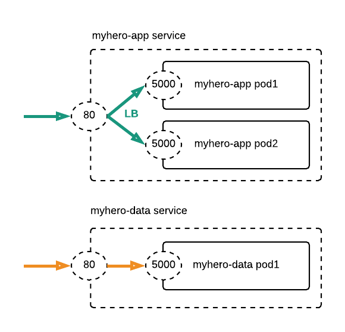
</p>

You may check your available services:

```shell
kubectl get services
```

```console
pi@master:~/myhero $ kubectl get services
NAME                      TYPE           CLUSTER-IP       EXTERNAL-IP     PORT(S)                                     AGE
kubernetes                ClusterIP      10.96.0.1        <none>          443/TCP                                     4d
myhero-app                NodePort       10.97.151.225    <none>          80:31238/TCP                                1h
myhero-data               NodePort       10.101.5.127     <none>          80:30122/TCP                                1h
```

The first one (*kubernetes*) is an internal one used by the system itself, so ignore it.

For our two *myhero* services you will see they are both configured as type *NodePort*. That means that you can access the service by querying **any** of your k8s nodes (*master*, *worker-01*, *worker-02* or *worker-03*) in the port specified as mapped to the service port (ie. 80).

Let's take a look at an example, and start by testing our new *myhero-data* service. We will leverage the same `curl` command we used for testing our development environment on laptops.

```shell
curl -X GET -H "key: SecureData" http://worker-02.local:30122/options
```

You should get the list of voting options. As you can see we are querying one of the worker nodes, but any node would work exactly the same. That is because k8s cluster nodes are all connected, and NodePort reserves that specific port in all nodes.

Now let's query *myhero-app* in a different node, and using its own service *NodePort*:

```shell
curl -X GET -H "key: SecureApp" http://worker-03.local:31238/options
```

You should get the same list of voting options again, although this time your request was routed by *myhero-app* towards *myhero-data*.

We can also try voting, and checking the results, with:

```shell
curl -X POST -H "key: SecureApp" http://worker-03.local:31238/vote/Deadpool
curl -X GET -H "key: SecureApp" http://worker-01.local:31238/v2/results
```

*myhero-app* also works well!

### What about Web and WebEx Teams?

If you remember our deployment of *myhero* on the development laptops, you already know by now that, apart from *myhero-ui*, both your *myhero-app* and *myhero-spark* need to be reachable from outside the local environment.

*myhero-app* needs to be reached by the browsers of our voters because the Web interface is implemented in AngularJS. *myhero-ui* will provide browsers with all required HTML, CSS, JavaScript code, and then the application will run client-side. This means that the browser will need to communicate directly with *myhero-app*, so that is why it needs to be reachable from the outside world.

*myhero-spark* needs to be publicly reachable because it implements the code that our WebEx Teams bot runs. So WebEx Teams servers need to be able to reach it for interaction, and these servers obviously reside on the Internet as well.

<p align="center"> 
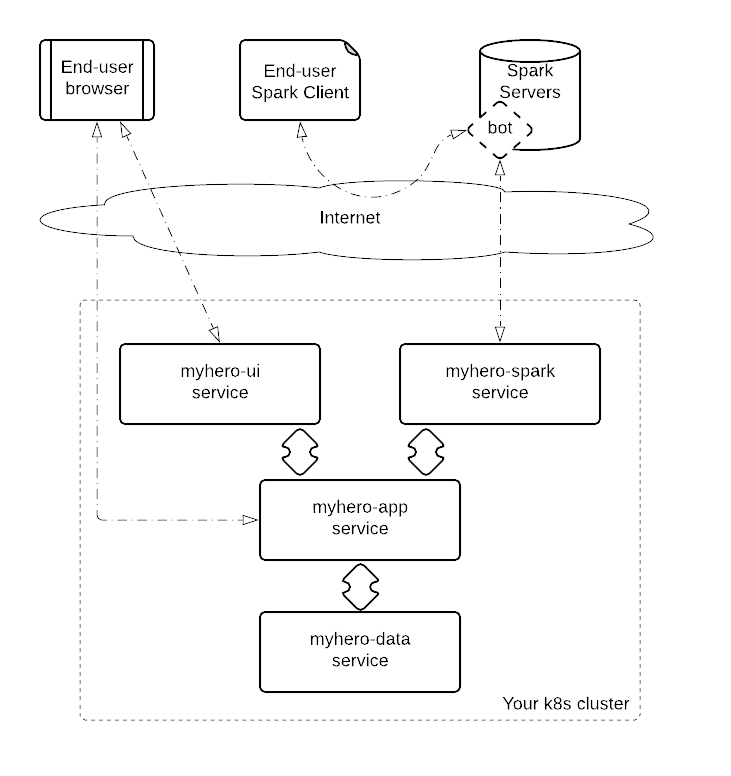
</p>

You may take a look at the k8s manifests and see what environment variables are required specifically for external connectivity:

1. For *k8s_myhero_ui.template* you need to provide the public URL of *myhero_app_server* and *myhero_spark_server*.
2. For *k8s_myhero_spark.template* you need to provide the public URL of your *myhero_spark_bot_url* (just another name for the same *myhero_spark_server*).

Now in our home setup these are a little bit tricky to provide. Why? Because they need to be publicly reachable URLs.

If you remember our setup resides in a private environment (home or office), where the only public IP address is the WAN of your gateway. We configured DDNS to have a [FQDN](https://en.wikipedia.org/wiki/Fully_qualified_domain_name) that is automatically updated if that WAN IP changes. And then we configured forwarding of an arbitrary port to our *master* node port 22. That way we could SSH to our *master* node from anywhere in the world.

Now we need something beyond that point. We need to expose specific *services* from our k8s cluster, and currently each one of them are only accessible *locally*, via one specific port in any of our k8s cluster nodes (*NodePort*).

We could achieve external connectivity in a similar way to what we did earlier. For each one of these services we could create yet another DDNS hostname / arbitrary port, and map it to our home router WAN IP / destination port. We would then create additional *virtual servers* in our home router and map  destination ports to the IP address of one k8s specific node and *NodePorts* where our services are available.

First problem with this approach is the every time any of our services restarted *NodePorts* would change, and we would have to reconfigure our home router again and again. Second problem is that mapping goes against a *single* node in the k8s cluster, so in case *that* node failed connectivity would be lost, even though the service could still be perfectly healthy running on pods in other nodes (as a scheduler would typically do). So definitely not the most optimal solution.

Kubernetes [Ingress](https://kubernetes.io/docs/concepts/services-networking/ingress/) manages external access to different services inside a cluster, so it is the perfect solution for this scenario. Not only it provides load-balancing to pods inside a service, but it can perform name-based virtual hosting as well. This capability maps multiple host names to the same IP address, and then to different services inside the cluster.

<p align="center"> 

</p>

In order for *ingress* resources to run in our cluster we will need to install an Ingress controller. There are several options available, public (ie. GCE) and private (ie. Nginx), so we will use our personal preference: [Traefik](https://traefik.io). It is an ingress controller that can act as a reverse proxy/loadbalancer on the service layer of Kubernetes. Traefik exposes services to the outside world.

But Traefik needs to be deployed itself as a *LoadBalancer* service. [LoadBalancers](https://kubernetes.io/docs/concepts/services-networking/service/#type-loadbalancer) provide an external IP that will load-balance to all pods belonging to that specific service, no matter what node they reside in. Unfortunately they are only implemented by Cloud Providers (like GCP, AWS or Azure), so configuring it in our on-prem setup would not provide any additional benefit because we would never get any public IP address. If you think about it your nodes reside in a LAN segment so they could never receive a *public* IP address.

But what if we could use *LoadBalancer* to obtain a *private* IP address that actually load-balances to every pod in our service? That is actually what Traefik needs to run in our setup.

[MetalLB](https://metallb.universe.tf) provides us with exactly that. It is a LoadBalancer implementation for bare metal k8s clusters. You define a pool of IP address it can serve, and it automatically load-balances all traffic addressed to them.

Let's install MetalLB in your cluster. Connect to your master node and run:

```shell
kubectl apply -f https://raw.githubusercontent.com/google/metallb/v0.6.2/manifests/metallb.yaml
```

It installs as a set of pods (a single controller, and then one speaker per worker node) you can monitor with:

```console
pi@master:~/temp $ kubectl get pods -n metallb-system
NAME                          READY     STATUS    RESTARTS   AGE
controller-849c5bdc6c-4mx68   1/1       Running   1          2d
speaker-hf6mk                 1/1       Running   1          2d
speaker-jmdvw                 1/1       Running   1          2d
speaker-nqbg8                 1/1       Running   1          2d
```

Then you need to provide MetalLB with a configuration file. You can download a template with:

```shell
wget https://raw.githubusercontent.com/google/metallb/v0.3.1/manifests/example-arp-config.yaml
```

Now edit that *example-arp-config.yaml* file and change the block of IP addresses you would like MetalLB to manage (in our case 192.168.1.240/28). Please make sure to configure your home router DHCP server to **not** allocate IP addresses from that block.

Apply the resulting configuration file:

```shell
kubectl apply -f example-arp-config.yaml
```

You can check the logs with:

```shell
kubectl logs -l app=speaker -n metallb-system
```

MetalLB is now installed in your k8s cluster!

We are now ready to install Traefik.

Please go to the Traefik directory and run the following commands to set the required permissions:

```shell
cd k8s/pi/traefik
kubectl create configmap traefik-conf --from-file=traefik.toml
kubectl apply -f traefik-rbac.yaml
```

Then you will need to run the Ingress controller itself, which will request a specific IP from MetalLB (shown in the last line of *traefik-deployment.yaml*). In our case we will use 192.168.1.250, that belongs to the MetalLB pool configured when we installed it (192.168.1.240/28).

```shell
kubectl apply -f traefik-deployment.yaml
```

Now you can check it has been correctly deployed and verify the requested IP address has been successfully allocated:

```console
pi@master:~/myhero $ kubectl get service traefik-ingress-service
NAME                      TYPE           CLUSTER-IP       EXTERNAL-IP     PORT(S)                                     AGE
traefik-ingress-service   LoadBalancer   10.111.243.177   192.168.1.250   80:30015/TCP,443:31734/TCP,8080:31601/TCP   2d
```

As you can see your LoadBalancer service (*traefik-ingress-service*) has been allocated the requested IP address. That means all traffic going to that IP will be received by Traefik, so that it can load-balance that traffic to the configured services.

Now, how do we configure our services to be load-balanced by Traefik? We need to create an Ingress resource, based on the content of *k8s_myhero_ingress.yml*

Please review its content to understand how we have configured our ingress. Basically we have 3 rules to identify the 3 services we want to be accessible from outside our environment: *myhero-ui*, *myhero-app* and *myhero-spark*. Each one of those rules define a hostname and what is the specific service Traefik should associate to it.

You will need to define those 3 hostnames in your DDNS provider. Luckily enough for us [NoIP](https://www.noip.com) supports a maximum of 3 hostnames in its free tier, so that is good enough for our setup.

Please note we could have used *subdomains* instead of different hostnames, but noip does not support subdomains in their free tier.

You will need to reprovision the *noip2* agent in your *master* node, so that it updates the 3 entries you just defined. Please run:

```shell
sudo noip2 -S
```

And use that process number to kill it:

```shell
sudo noip2 -K <process_number>
```

Now create a new configuration:

```shell
sudo noip2 -C
```

Select interface *eth0*, provide your username / password, and answer the following questions like this:

```console
3 hosts are registered to this account.
Do you wish to have them all updated?[N] (y/N)  y
Please enter an update interval:[30]  5
Do you wish to run something at successful update?[N] (y/N)  N

New configuration file '/tmp/no-ip2.conf' created.
```

Check your configuration is correct:

```shell
sudo noip2 -S
```

And finally run *noip*:

```shell
sudo noip2
```

The *noip* agent will now update the DDNS service for those 3 hostnames, making sure they are always up-to-date with the latest WAN IP of our home router.

Back to our *k8s_myhero_ingress.yml* you will see the mapping of those 3 hostnames to their respective 3 services.

Ingress is capable of mapping different URLs to a single IP, and then differentiate traffic forwarding it to multiple services, based on the destination URL. This is called name-based virtual hosting.

Ingress is now working... what a ride!

You may now go back to the source of needing an Ingress resource: providing external connectivity to *myhero-app* and *myhero-spark* microservices.

So first create a manifest for *myhero-ui* based on the provided template, and edit it:

```shell
cd ../myhero
cp k8s_myhero_ui.template k8s_myhero_ui.yml
vi k8s_myhero_ui.yml
```

You will need to fill in the values for *myhero_spark_server* and *myhero_app_server*, with the URLs from your noip hostnames:

*http://\<spark-hostname>:<home_router_port>*

*http://\<app-hostname>:<home_router_port>*

You are now ready to create the service and deployment:

```shell
kubectl apply -f k8s_myhero_ui.yml
```

Check everything looks good:

```console
pi@master:~/myhero/k8s $ kubectl get svc myhero-ui
NAME        TYPE       CLUSTER-IP      EXTERNAL-IP   PORT(S)        AGE
myhero-ui   NodePort   10.108.29.166   <none>        80:32587/TCP   1d
pi@master:~/myhero/k8s $ kubectl get deployment myhero-ui
NAME        DESIRED   CURRENT   UP-TO-DATE   AVAILABLE   AGE
myhero-ui   2         2         2            2           1d
```

Same process for *myhero-spark*:

```shell
cp k8s_myhero_spark.template k8s_myhero_spark.yml
vi k8s_myhero_spark.yml
```

In this case you will need to provide *myhero_spark_bot_email*, *spark_token*, *myhero_spark_bot_url*. The first two fields will be the ones you got from [WebEx Teams for Developers website](https://developer.webex.com/index.html) when you created your bot. The third field will be *myhero-spark* public URL, again based on the info from noip that you configured: *http://\<spark-hostname>:<home_router_port>*

With that you can now save the file and apply it:

```shell
kubectl apply -f k8s_myhero_spark.yml
```

Check if everything looks good for *myhero*:

```shell
kubectl get all
```

You can now test both user interfaces. Point your browser to *http://\<ui-hostname>:<home_router_port>* and you should get *myhero* splash page, where you can see the available options, vote and check the results.

For WebEx Teams run the following command from your laptop terminal:

```shell
curl http://<spark-hostname>:<home_router_port>/hello/<your_WebEx_Teams_email_address>
```

You will receive a welcome message from the bot asking if you would like to vote, and you will be able to interact with it using */options*, */vote* and */results*.

Everything is working! We can go home now... or not really?

### Now we need queues

If you test extensively your current *myhero* deployment you will soon realize that by the time you have multiple users voting concurrently, your application will not be able to cope with the load and fail.

The reason for this is that *myhero-data* cannot accommodate a high number of simultaneous requests to update its database (which is just a text file, by the way). If we want to address this challenge we need to implement a *buffering* system between *myhero-app* and *myhero-data*, so that *myhero-app* can send votes out when they arrive, and *myhero_data* can *process* them when it can.

We can implement this with a *queueing* system, based on [MQTT](https://en.wikipedia.org/wiki/MQTT). Votes are published by *myhero-app* towards the MQTT Server, and later they are processed by a *consumer* service that subscribes to the queue. To implement this model we need to deploy two additional services: the MQTT server and the *consumer*.

Luckily enough for us there is already a docker image that implements a MQTT server, ready to be reused in our RPi boards, so no need to re-invent the wheel here. We will use *damianmoore/mosquitto-arm32v6*, as you can see if you review your *k8s_myhero_mosca.yml* file.

You can directly apply it with:

```shell
kubectl apply -f k8s_myhero_mosca.yml
```

For the *consumer* service that processes votes we will need to build it the same way we did for *myhero-ui*, *myhero-app* or *myhero-data*.

```shell
cd ../../../..
git clone https://github.com/juliogomez/myhero_ernst.git
cd myhero_ernst
docker build -t <your_DockerHub_user>/pi-myhero-ernst .
docker push <your_DockerHub_user>/pi-myhero-ernst
cd ../devops/k8s/pi/myhero
kubectl apply -f k8s_myhero_ernst.yml
```

Now you should have both *myhero-mosca* and *myhero-ernst* correctly deployed in your system.

The only missing part would be to tell *myhero-app* to start using *myhero-mosca* instead of sending votes directly to *myhero-data*.

In order to accomplish this you just need to edit your *k8s_myhero_app.yml* and *uncomment* (**remove** the # character at the beginning of the line) *myhero_app_mode* environment variable:

```yaml
#          - name: myhero_app_mode
#            value: queue
```

Then you apply that file again with:

```shell
kubectl apply -f k8s_myhero_app.yml
```

And you are done!

Now *myhero-app* will publish votes to *myhero-mosca*, and then *myhero-ernst* will pull them as they can be processed to send them to *myhero-data*. 

*myhero-app* will continue interacting with *myhero-app*, but only to retrieve the voting options and results.

<p align="center"> 
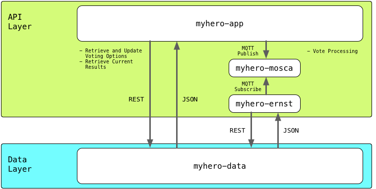
</p>

Please go ahead and test that your application still works, by voting with the Web Interface and WebEx Teams. Its functionality should be the same, but now it will be able to process a higher number of concurrent users!

### A Dashboard to manage them all

Now that your cluster is all set, and your application is deployed, you might be wondering if there could be an option to manage your system from a GUI. We can be CLI guys and want to run `top` or `htop` to see how each server is doing, but that does not really go well with the *modern* approach we are following for everything else.

We need a dasboard. And while we are at it, let's please have a *good* one. Something that shows comprehensive information about our deployments, but also on the cluster itself.

And as long as we have built a container scheduler, why don't we make the dashboard available via... containers? Wow, let that sink in. So the dashboard that manages my containers and my cluster is actually a container itself? Talk about [Inception](http://www.imdb.com/title/tt1375666/)...

But yes, that's a good and easy way to deploy it. So let's start by taking a look at [Kubernetes Dashboard](https://github.com/kubernetes/dashboard), a nice and simple web-based dashboard that allows you to manage applications running in your cluster.

<center><src="http://ia.media-imdb.com/images/M/MV5BMTg4NzEyNzQ5OF5BMl5BanBnXkFtZTYwNTY3NDg4._V1._CR24,0,293,443_SX214_AL_.jpg"></center>


Instead of describing it, let's quickly deploy it and you will see what it offers.

Open a new terminal, connect to your master node, and go to the dashboard directory:

```shell
cd devops/dashboard
```

First thing you need to do is to create a new *admin* account for the dashboard to use. This is required because the dashboard will need special access to the cluster. Think about it, containers usually do not have access to cluster info or other deployments, so we need to enable that.

```shell
kubectl apply -f dashboard-admin-account.yaml
```

Now you can deploy the dashboard itself:

```shell
kubectl apply -f dashboard.yaml
```

We are deploying it as a *NodePort* service, so you should be able to access it with your browser pointing to the IP address of any of your nodes, and the port assigned by the service. For example:

```console
pi@master:~ $kubectl get services kubernetes-dashboard -n kube-system
NAME                   TYPE       CLUSTER-IP      EXTERNAL-IP   PORT(S)        AGE
kubernetes-dashboard   NodePort   10.108.203.74   <none>        80:31383/TCP   23h
```

In my case I could point my browser to `192.168.1.100:31383` and access the dashboard there.

But now you know about *Ingress*, so you might probably want to *do it right*. So we can create a new ingress resource that points to the dashboard. That way we will be able to access it with a URL in our browser, instead of an *IP:port* combination.

As long as we got to the maximum number of hostnames in NoIP free tier, let's do something different. We will create an ingress resource, but only to be used from the *internal* network. That means the dashboard will not be accessible from the outside world, but let's suppose we only want to manage it locally, so for our case that should be okay.

The most basic name resolution system is the `/etc/hosts` **in your laptop**, so let's edit it and add an entry like this:

```console
192.168.1.250   dashboard.internal.julio.com
```

The specified IP address is the one assigned by MetalLB to Traefik. That way, when we put the defined URL in our browser, it will automatically be redirected to Traefik. Based on the URL it knows what service it should send it to.

Now go back to the terminal connected to the *master* node, edit the ingress file and include the URL you defined as *host*:

```shell
vi dashboard-ingress.yaml
```

Once done, apply the ingress resource:

```shell
kubectl apply -f dashboard-ingress.yaml
```

Check that it has been correctly applied:

```console
pi@master:~ $kubectl get ingress -n kube-system
NAME                   HOSTS                          ADDRESS   PORTS     AGE
kubernetes-dashboard   dashboard.internal.julio.com
```

Now go to your browser and check you can access the dashboard via `dashboard.internal.julio.com`

Success! Your dashboard is now accessible from the internal network with the URL you defined.

( Optional: if you are bold and have access to your own DNS service, you could try and create an *external* ingress resource, to make the dashboard accessible from Internet. It should be very similar to what we did for *myhero* external accessibility in previous sections of this document. )

Go through the dashboard and see the multiple benefits it offer. But you will soon notice that there is no information on the cluster itself and its nodes. You cannot find those nice graphs on CPU and memory consumption. That is because you need [Heapster](https://github.com/kubernetes/heapster/) to monitor cluster resources usage. 

Heapster needs [InfluxDB](https://github.com/kubernetes/heapster/blob/master/docs/influxdb.md) as a backend, and in time InfluxDB needs [persistent volumes](https://kubernetes.io/docs/concepts/storage/persistent-volumes/) (PV) to be deployed. PVs are *consumed* by applications, like InfluxDB, via persistent volume claims (PVC). PVs are provisioned by the system admin and *offered* to applications, that in time *claim* them when required.

But instead of having to manually provision PVs, we can automate it by creating a [StorageClass](https://kubernetes.io/docs/concepts/storage/storage-classes/). This way applications just request what they need from any available StorageClass, based on their specific requirements.

StorageClasses need a provisioner to define what volume plugin is used for provisioning PVs, so there are multiple options. Many are Cloud native, but we also have options to deploy on-premises.

A simple way is to use [NFS](https://en.wikipedia.org/wiki/Network_File_System) to share a USB hard disk connected to one of the cluster nodes.

So let's review what we are going to do: in order to have visibility about cluster resources in our k8s dashboard, we are going to deploy Heapster, that requires InfluxDB, that requires PVs, that we will offer with a StorageClass, that we will provision on a HD offered via NFS... **NICE.**

Obviously we need to start *backwards*, so let's start by connecting a USB hard disk to one of your k8s cluster nodes (even better if it is USB powered, so you don't need an additional power supply for it). In my case I plugged it in *worker-01*.

Open a new terminal, connect to the node where you plugged the HD, and check that you can see the HD and its partitions:

```shell
ls /dev/sda*
```

*sda* is the HD itself, while *sda1*, *sda2* are the partitions it includes.

You may check your partitions format with:

```shell
df -Th
```

Choose the partition you would like to use (in my case *sda2*) and, if required, format it as [ext4](https://en.wikipedia.org/wiki/Ext4), with:

```shell
sudo mkfs.ext4 /dev/sda2 -L untitled
```

Once done mount the partition on a new directory:

```shell
sudo mkdir /mnt/extusb
sudo mount /dev/sda2 /mnt/extusb
ls /mnt/extusb
sudo fdisk -l
```

Let's not forget to make this mount persist on reboot, so please edit */etc/fstab* and add the following line:

```console
/dev/sda2  /mnt/extusb  ext4  defaults  1 1
```

Now we need to install a NFS server:

```shell
sudo apt-get install nfs-kernel-server nfs-common
sudo systemctl enable nfs-kernel-server
```

Create the folder you would like to share via NFS:

```shell
sudo mkdir kube
```

Edit */etc/exports* and include the following line to share that folder in your own IP segment:

```
/mnt/extusb/kube/ 192.168.1.*(rw,sync,no_subtree_check,no_root_squash)
```

Enable the export with:

```shell
sudo exportfs -a
```

Congrats! The node where you plugged your HD is now sharing one folder via NFS.

Next step is to use the NFS external provisioner ([nfs-client-provisioner](https://github.com/kubernetes-incubator/external-storage/tree/master/nfs-client)) to create a StorageClass that can dynamically allocate PVs.

From the terminal connected to your *master* node, go to:

```shell
cd devops/nfs
```

There you will need to first create a new [service account](https://kubernetes.io/docs/tasks/configure-pod-container/configure-service-account/), with:

```shell
kubectl apply -f auth/.
```

Then deploy the *nfs-client-provisioner* pods:

```shell
kubectl apply -f deployment-arm.yaml
```

And finally create the new StorageClass:

```shell
kubectl apply -f class.yaml
```

Configure your StorageClass to be the default one:

```shell
kubectl patch storageclass nfs-ssd-node1 -p '{"metadata":{"annotations": {"storageclass.kubernetes.io/is-default-class": "true"}}}'
```

Great! Now you have a working StorageClass that any application can use to request PVs from.

You may now install Heapster and its backend, InfluxDB. From your terminal window connected to the *master* node:

```shell
cd devops/heapster
kubectl apply -f .
```

Monitor the *heapster* pod until it is running and available (ready 1/1):

```shell
kubectl get pods -n kube-system
```

After some minutes refresh your browser while pointing to the k8s dashboard and you will start seeing those nice cluster resource graphs!

### Monitoring your cluster and applications

As you start using microservices-based applications you will discover that the need for a good monitoring service is more *real* than ever. You must consider that now applications consist of many different elements that must be monitored independently. A higher number of elements per application drive the need for a really good and useful monitoring solution.

There are multiple options to implement a customised monitoring solution, each one of them suitable to individual requirements you might have in your scenario.

We will use [Prometheus Operator](https://github.com/coreos/prometheus-operator), a tool that automates Prometheus instances management.

[Prometheus](https://prometheus.io) is a systems monitoring toolkit. It provides a multi-dimensional data model with time series data identified by metric name and key/value pairs. Its server scrapes and stores time series data from multiple sources, called *exporters*.

We will install our first exporter manually, and that is [cAdvisor](https://github.com/google/cadvisor) (Container Advisor), a tool that provides information on resources used by running containers.

```shell
cd devops/monitoring
kubectl apply -f manifests/cadvisor/
```

Check cAdvisor port to access it:

```console
pi@master:~ $ kubectl get service cadvisor
NAME       TYPE       CLUSTER-IP     EXTERNAL-IP   PORT(S)          AGE
cadvisor   NodePort   10.111.148.5   <none>        8080:32552/TCP   7m
```

As long as the service is configured as *NodePort*, you can test it and access directly its web interface on *\<any-node-IP>:\<service-port>*

In my case, and as per the output above, I could point the browser to `192.168.1.100:32552`

According to the official deployment documentation [here](https://github.com/coreos/prometheus-operator/blob/master/contrib/kube-prometheus/docs/kube-prometheus-on-kubeadm.md), a couple of changes are required on the cluster:

1. We need to expose cadvisor and allow webhook token authentication. To do so, we do the following **on all nodes** (master and workers):

```shell
sudo sed -e "/cadvisor-port=0/d" -i /etc/systemd/system/kubelet.service.d/10-kubeadm.conf
sudo sed -e "s/--authorization-mode=Webhook/--authentication-token-webhook=true --authorization-mode=Webhook/" -i /etc/systemd/system/kubelet.service.d/10-kubeadm.conf
sudo systemctl daemon-reload
sudo systemctl restart kubelet
```

2. Additionally, you need to run the following **only on the master node**, to change the address where kube-controller-manager and kube-scheduler listens:

```shell
sudo sed -e "s/- --address=127.0.0.1/- --address=0.0.0.0/" -i /etc/kubernetes/manifests/kube-controller-manager.yaml
sudo sed -e "s/- --address=127.0.0.1/- --address=0.0.0.0/" -i /etc/kubernetes/manifests/kube-scheduler.yaml
```

Now we will install the rest of the sytem, via a script called `deploy`. It will automatically deploy all required manifests to install:

- **Prometheus-operator**: element that manages all components
- **Prometheus**: collecting and time-series database to store all data
- **node-exporter**: collector to fetch node data, like HW and OS metrics
- **arm-exporter**: collector to fetch board temperature
- **alertmanager**: provides alarm notifications sent by Prometheus
- **Grafana**: the dashboard GUI
- **kube-state-metrics**: collector for Kubernetes cluster stats
- **SMTP relay**: to provide email notifications

But before using the `deploy` script we need to configure some parameters:

The following elements provide GUIs accessible via *ingress* resources, so you should configure their internal URLs (don’t forget to update the `/etc/hosts` file **in your laptop**):

- Prometheus, in `manifests/prometheus/prometheus-k8s-ingress.yaml`
- AlertManager, in `manifests/alertmanager/alertmanager-ingress.yaml`
- Grafana, in `manifests/grafana/grafana-ingress.yaml` 

Add your gmail credentials (user and password) in `manifests/smtp-server/smtp.yaml`, so the system can send out emails for alerts, and just your gmail address in `manifests/grafana/grafana-configmap.yaml`

Once you have everything configured, please run:

```shell
cd devops/monitoring
deploy
```

`deploy` will create a new namespace, called *monitoring*, where all related pods will be deployed. Check all pods are running in that new namespace, with:

```shell
kubectl get pods -n monitoring
```

When all deployments are completed you may access Grafana from its ingress URL, in my case pointing the browser to `grafana.internal.julio.com` (default access with user *admin* and password *admin*).

You may find some additional custom Grafana dashboards for your setup in the `grafana-dashboards` directory. These are really useful for a RPi cluster, as they provide visibility about critical system metrics. Import them from the Grafana GUI with the `+` sign and then `import` - `Upload .json File`.

Congratulations!!! If you got here you have gone a looong way since we started this tutorial.

## Public Cloud deployment

Using public Cloud providers services (like [GCP](https://cloud.google.com), [AWS](https://aws.amazon.com) or [Azure](https://azure.microsoft.com)) is a nice options for multiple scenarios. Let's say you do not have any on-prem infrastructure and would like to quickly deploy a new application. Or you do not want to deal with maintaining that infra, you would rather pay for the service and have someone else do it for you. Or you are not sure about the level of success of your application, and would need the [elasticity](https://en.wikipedia.org/wiki/Elasticity_(cloud_computing)) delivered by Cloud providers. In any of those cases Cloud services might be a good fit for you, and Cloud providers offer many different services around [IaaS](https://en.wikipedia.org/wiki/Infrastructure_as_a_service), [PaaS](https://en.wikipedia.org/wiki/Platform_as_a_service) and [SaaS](https://en.wikipedia.org/wiki/Software_as_a_service). 

For us we would like to have a scheduler (ie. k8s) help deploying our modern microservices-based application. One option would be to get some VMs from any Cloud Provider and build our k8s cluster from scratch. But we have already explored how to build a cluster in the 'on-prem' section of this tutorial.

Let's try an easier way. Some of these providers offer the option of providing you with *managed* k8s service. This means they give you the nodes pre-installed so that you can focus only on operating the solution. So why not? We will choose a managed k8s service for this section.

* GCP offers [Google Kubernetes Engine](https://cloud.google.com/kubernetes-engine/) (GKE)
* AWS has [Amazon Elastic Container Service for Kubernetes](https://aws.amazon.com/eks) (EKS) in preview currently
* Azure has [Azure Container Service](https://azure.microsoft.com/en-us/services/container-service/) (AKS)

### GKE setup

For our tutorial we will choose GKE, but you can try with your own preference.

You can work on GCP resources with their browser-embedded [Cloud Shell](https://cloud.google.com/shell/) or install their [Cloud SDK](https://cloud.google.com/sdk/) [gcloud CLI](https://cloud.google.com/sdk/downloads) in your laptop.

If you prefer the second option you will also need to install `kubectl` CLI in your laptop:

```shell
gcloud components install kubectl
```

Before you can start working you will need to define a couple of parameters for `gcloud`: your *default project* and *compute zone* (you may see the available ones with `gcloud compute zones list`). Configuring this params help not having to specify them in every subsequent command.

```shell
gcloud config set project <your_project_id>
gcloud config set compute/zone <selected_zone>
```

Now you can create your k8s cluster with a single command (default is a 3-node cluster, configurable with `--num-nodes`):

```shell
gcloud container clusters create <cluster_name>
```

When completed you can request the authentication credentials to interact with your cluster:

```shell
gcloud container clusters get-credentials <cluster_name>
```

You can see info about your cluster with:

```shell
gcloud container clusters describe <cluster_name>
kubectl get nodes
```

Your Kubernetes cluster is now ready!

### Disable DDNS

We can now work on how to deploy *myhero*. As you can imagine it will be *really* similar to the way we did it in our on-prem deployment.

Before we can work on deploying the application itself let's sort out our DNS resolution. We will be deploying *ingress* as well here, so if we want to use the same DDNS we were using before in the on-prem scenario, we will have to reconfigure it.

First thing we need to do is to stop the *noip2* agent in our RPi master, so that it stops sending updates to NoIP servers. Login into your RPi and run:

```shell
sudo noip2 -S
```

Use the process number to run:

```shell
sudo noip2 -K <process_number>
```

Now there will be no more updates from your on-prem setup to NoIP servers. 

Login with your user into [NoIP](noip.com) and note that your entries are still there. Please do not delete them, we will reuse them.

### Application deployment

Go into the directory where all k8s manifests reside:

```shell
cd devops_tutorial/devops/k8s/gce
```

Copy the *ingress* template to the proper manifest name:

```shell
cp k8s_myhero_ingress.template k8s_myhero_ingress.yml
```

Edit *k8s_myhero_ingress.yml* to include the 3 required *host* values, for *ui*, *spark* and *api*. Save the file.

Now is time to update the manifest for *myhero-ui*, so copy it from the template:

```shell
cp k8s_myhero_ui.template k8s_myhero_ui.yml
```

Edit *k8s_myhero_ui.yml* and update the image name, and environment variables for *myhero_spark_server* and *myhero_app_server* with the URLs for your DDNS hostnames (ie. http://...)

Do the same with *myhero-spark*, copy from the template to the proper manifest name:

```shell
cp k8s_myhero_spark.template k8s_myhero_spark.yml
```

Please edit *k8s_myhero_spark.yml* to update the image name and include your bot email (*myhero_spark_bot_email*), its token (*spark_token*) and DDNS hostname for spark (*myhero_spark_bot_url*).

We are now ready to deploy your application. Make sure to edit all your manifests and replace the image name for the ones you built.

Now let's be brave and apply all at once!

```shell
kubectl apply -f .
```

Monitor your pods until all of them are *Running* and *READY 1/1* (ctrl+c to get out).

```shell
kubectl get pods -w
```

Watch how ingress is created until the *ADDRESS* field gets and IP address (ctrl+c to get out):

```shell
kubectl get ingress myhero-ingress -w
```

Use that IP address to update the 3 hostname entries you created at [NoIP](noip.com). That way traffic going to those hostnames will be automatically redirected to our k8s cluster ingress resource.

You may monitor when your DNS entries are refreshed with the new IP:

```shell
dig <hostname> +short
```

Once `dig` shows the new IP address for the 3 hostnames you are good to go.

Use the following command to describe your ingress, and wait until under Annotations-backends all 4 entries go from *Unknown* to *HEALTHY* (it might take 5-10 mins)

```shell
kubectl describe ingress myhero-ingress
```

Your application is now live!

Just point your browser to *myhero-ui* DDNS hostname and you should be able to access it!

### Cluster management

If at a certain point you want to stop the billing for your k8s cluster, but would not like to delete it and have to re-create it again later, you may just resize it to 0 nodes with:

```shell
gcloud container clusters resize <cluster-name> --size=0
```

When you need to bring it back, you just need to issue:

```shell
gcloud container clusters resize <cluster-name> --size=3
```

When you are done testing *myhero* please delete the whole deployment:

```shell
kubectl delete -f .
```

If you are really done with your k8s cluster you can easily delete it with just one command:

```shell
gcloud container clusters delete <cluster_name>
```

## Helm package manager

[Helm](https://helm.sh) is a package manager for Kubernetes. It helps defining, installing and upgrading complex k8s applications. Instead of applying individual YAML files, you can package all of them and deploy your application easily. That package is called a *chart*, and its deployment a *release*.

It offers amazing *templating* capabilities as well, but for this tutorial we will only use its help with application *packaging*.

Helm has 2 components: *client* (local agent that communicates with the server) and *server* (called *tiller*, that runs inside the k8s cluster). Tiller is the one that communicates with k8s API server to deploy the required resources in the k8s cluster.

<p align="center"> 
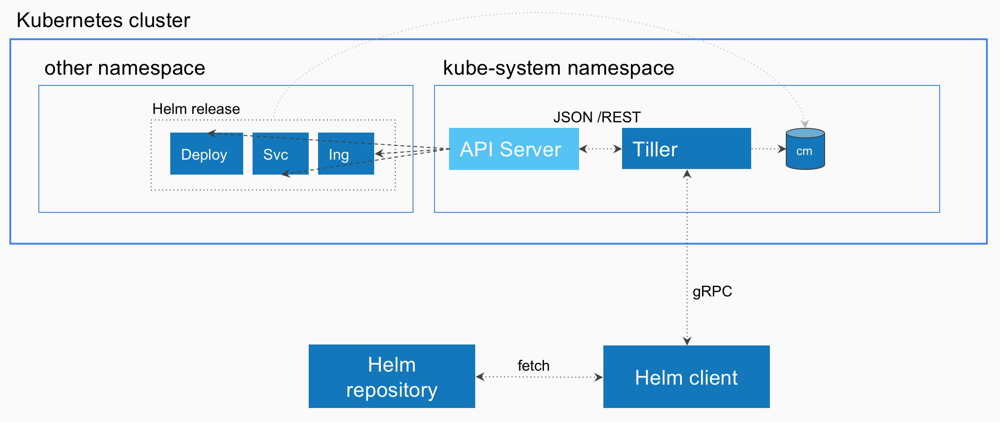
</p>

You will need to [install the Helm client in your laptop](https://github.com/kubernetes/helm/blob/master/docs/quickstart.md).

As a Mac user you can install the Helm client with:

```shell
brew install kubernetes-helm
```

For our tutorial we will use the k8s cluster we deployed on GCE, but of course you could also use the on-prem setup if you had the chance to build it.

Make sure your kubectl context points to the GCE cluster, and all your nodes are ready:

```shell
kubectl config get-contexts
kubectl get nodes
```

Use your *helm* client to deploy the *tiller* server in your k8s cluster with a simple command:

```shell
helm init
```

List all available *stable* charts (ie. packages):

```shell
helm search
```

Or look for a specific one, like for example WordPress:

```shell
helm search wordpress
```

Let's use [WordPress](https://wordpress.org) as an example. As you probably know WP is an open-source web/blog platform. It is composed by a web server front-end and a database. If you wanted to deploy it manually you would at least need to manage and configure for interoperability two containers: one webserver and one database. 

Helm helps you by providing a chart where everything is configured for you, so you can easily deploy the whole application with:

```shell
helm install --name my-wp stable/wordpress
```

You will see Helm returns some indications on how to access your WP deployment (URL, username and password).

Make sure both of your pods (wordpress and mariadb) are *running* and *ready 1/1*.

```shell
kubectl get pods
```

And wait until your new WP LoadBalancer service gets an external IP address.

```shell
kubectl get services
```

Once the external IP address is populated, you can use to access your new WordPress deployment from your browser.

Easy, huh?

Helm allows you to create your own *charts*, so why don't we create one for *myhero? That way we will not have to deal with all individual YAML files, but rather install it easily with a single command.

Helm is based on *templating*, so we could create some templates and instantiate them with values for each one of the services and deployments. But as long as this is not a Helm tutorial let's not use templates and do it the easy way.

Go into *devops* directory and create a new helm directory there:

```shell
cd devops
mkdir helm
```

Create a new helm chart:

```shell
helm create myhero
```

Go into the *templates* directory and delete all templates in there (that we will not use) and copy all *myhero* YAML files:

```shell
cd myhero/templates
rm *
cp ../../k8s/gce/*.yml .
```

Now go out of that directory and create *myhero* helm chart, and you will get a *myhero-0.1.0.tgz* file:

```shell
cd ../..
helm package myhero
ls
```

Now you can deploy *myhero* with a single command:

```shell
helm install --name helm-myhero myhero-0.1.0.tgz
```

Watch pods, services and ingress being created:

```shell
kubectl get pods
kubectl get services
kubectl get ingress
```

Please remember if you want to access your app from Internet, you will need to make sure that name resolution (ie. DDNS) for your 3 hostnames is updated with new the public IP address you have in your Ingress now.

Once you are finished you may easily delete your myhero application:

```shell
helm delete --purge helm-myhero
```

## Service Mesh

Even when using a scheduler there are several important features that you might be missing from a standard container-based application deployment:

* Load-balancing
* Service-to-service authentication
* Monitoring

And it would be great to implement them without having to modify the code in our existing microservices. We would like these features to be *decoupled* from service containers, so that Developers do not need to be concerned about these aspects.

One way to implement these services is via a *sidecar proxy* (called *envoy*) next to each container, to intercept all incoming and outgoing communications. The interaction between all these proxies in the data plane, together with a common control plane, is what we call a *service mesh*.

**[Istio](https://istio.io)** is an open-source approach to how you can implement a *service mesh* in your multi-Cloud Kubernetes clusters. It will help you understand traffic flows among services and how to manage them with policies, protection and authentication.

Using Istio you might, for example, define the percentage of traffic you want to send to a specific *[canary version](https://martinfowler.com/bliki/CanaryRelease.html)*, no matter what the size of its deployment is. Or determine how to distribute traffic based on information included in the request headers (ie. [user-agent](https://en.wikipedia.org/wiki/User_agent#Use_in_HTTP) in HTTP requests), source/destination, or service version weights.

A service mesh allows you to decouple traffic management from application code. This way you can do A/B testing, gradual rollouts, and canary releases.

Additionally Istio provides useful capabilities around *failure recovery* to tolerate failing nodes or avoid cascading instabilities, and *fault injection* (delays or connectivity failures) on specific requests to test application resiliency.

### Installing Istio

Depending on your environment (on-prem or Cloud) you will have to follow the instructions on [how to setup Istio with Kubernetes](https://istio.io/docs/setup/kubernetes/quick-start.html), and it will be installed in its own namespace (*istio-system*).

```
curl -L https://git.io/getLatestIstio | sh -
cd istio-0.8.0
export PATH=$PWD/bin:$PATH
kubectl apply -f install/kubernetes/istio-demo.yaml
cd ..
```

Check everything is ready:

```
kubectl -n istio-system get svc
kubectl -n istio-system get pods
```

**Cool!** Istio is now ready in our system, let's give a try with our modern microservices-based example application: *myhero*.

This time we will deploy *myhero* in its own namespace so let's create it, label it for Istio injection (so that all pods in that namespace get a sidecar proxy container injected), and then deploy. For this example we assume you are using a Google Kubernetes Engine (GKE) managed cluster, but you could use any other option, including an on-prem setup:

```
git clone https://github.com/juliogomez/devops.git
cd devops/k8s/gce
kubectl delete -f .
cd istio
kubectl create namespace myhero
kubectl label namespace myhero istio-injection=enabled
kubectl get namespace -L istio-injection
```

Complete the required information in all manifests with *.template* extension in the *myhero* and *routing* folders. Once done rename them from *.template* to *.yml*.

Apply the ones in *myhero* folder for the initial setup:

```
kubectl apply -f myhero/istio*
kubectl -n myhero apply -f myhero/k8s_myhero*
```

If you take a look at the new pods, you will immediately notice that they include 2 containers, instead of just 1 as before (ie. READY 2/2):

```
kubectl -n myhero get pods
```

You will be able to access *myhero* public IP address from your own browser and see the application working. Those new sidecar proxy containers that are intercepting all I/O are transparent to the service.

For our capabilities demonstration today we will focus on some specific *traffic management* use cases, although Istio provides multiple security and telemetry capabilities as well.

Istio configuration for traffic rules is done via YAML manifests. There are 3 types of rules:

* Route rules: send traffic to different versions of a service based on source/destination, HTTP header fields (ie. username), or service version weights. You may also change the timeout for HTTP requests or number of retries, and inject faults (delays or failures) for filtered traffic.
* Destination policies: define the load-balancing algorithm, circuit-breakers, and health checks.
* Egress rules: to allow calls to services in external domains.

### Use case 1: routing to specific service version

For *myhero-ui* we have defined 3 different versions (*v1, v2 and v3*), each one of them with a different header: "Make ONE voice heard!!!", "Make TWO voices heard!!!" and "Make THREE voices heard!!!". That way we will easily identify what version we are accessing.

If you access *myhero-ui* public IP address from your browser, and refresh several times, you will notice this header changing as you access different versions of your *myhero-ui* service.

Let's set *v1* as the default version to use when accessing *myhero-ui*:

```
cd routing
kubectl apply -f 1-ui_all_to_v1.yml
```

If you review the manifest you will notice it includes a *VirtualService* that defines a rule to route all traffic going to *myhero-ui* service, so that it reaches exclusively pods labelled with  *v1*. It also includes a *DestinationRule* that defines the different available versions (*subsets*).

Please review the applied route (you may use this in all subsequent use cases examples):

```
kubectl get virtualservice myheroui-rule -o yaml
kubectl get destinationrule myhero-ui-destination -o yaml
```

Refresh your browser several times while pointing to *myhero-ui* public IP and you will notice now you only get the *v1* header: "Make ONE voice heard!!!".

This way Istio allows you to deploy several different pods in the same service, and choose which one to use as default for your users.

### Use case 2: delay injection

Now let's do something different and inject a delay to test the resiliency of our application. For each request from our browser to *myhero-ui* we will inject a 5 seconds delay.

```
kubectl apply -f 2-ui_inject_delay.yml
```

Refresh your browser and you will experience a slower response time. That way you can test how your application microservices handle unexpected response time delays. If you review the manifest you will notice you can define what specific traffic will be affected by this rule. In our case we are using 100% of traffic to simplify the example.

Maybe you are wondering why the total delay experienced by the end user is much higher than 5 seconds... more like in the 20-25 seconds range. Well, let's dig in a little bit. From IE, Chrome or Firefox press *Ctrl+Shift+I* or *Alt+Cmd+I* to enter the *Developer tools*, go to tab *Network* and refresh your browser. You will be able to see the 5 seconds delay **for each request**, and the accumulated total to explain why users get a much slower response time.

Remove the injected delay:

```
kubectl apply -f 1-ui_all_to_v1.yml
```

### Use case 3: HTTP abort injection

In this case we will inject a fault where *myhero-app* responds with HTTP abort (HTTP status 500):

```
kubectl apply -f 3-app_HTTP_abort.yml
```

Refresh your browser and you will notice now the list of available superheroes is not there anymore. This list was provided by *myhero-app*, so now that it is aborting its connections, our application cannot show the list anymore.

This way Istio allows us to insert artificial faults in our microservices, and test how those faults reflect in the overall application.

Remove the artifically injected fault:

```
kubectl apply -f 0-app_initial_status.yml
```

### Use case 4: gradual migration to new version

Istio allows us to migrate to new service versions in a gradual way. Let's suppose our *myhero-ui* versions (*v1, v2, v3*) are sequential ones with new features or bug fixes.

Our initial status is all traffic goes to *v1*, so let's migrate for example 50% of the traffic to the newest *v3*.

```
kubectl apply -f 4-ui_50_to_v3.yml
```

Refresh your browser multiple times and you will see how 50% of the times you get *myhero-ui v1* header ("Make ONE voice heard!!!") and the other 50% of times you get *myhero-ui v3* header ("Make THREE voices heard!!!").

This way you can smoothly migrate traffic from one service version to another, being able to define how much traffic you want directed to each service no matter what is the size of the deployment.

Once *v3* is completely stable, you can easily migrate 100% of your traffic to the new version:

```
kubectl apply -f 5-ui_all_to_v3.yml
```

### Use case 5: mirroring traffic

Istio also allows you to mirror traffic, maybe from a live service to a newer one out of production, so you can test how that new one behaves when it gets *real* traffic.

For our test let's first direct all traffic back to *myhero-ui v1*.

```
kubectl apply -f 1-ui_all_to_v1.yml
```

Now open a second terminal window and leave it monitoring logs for pods belonging to the *v1* version:

```
export UI_V1_POD=$(kubectl -n myhero get pod -l app=myhero,version=v1 -o jsonpath={.items..metadata.name})

kubectl -n myhero logs -f $UI_V1_POD -c myhero-ui
```

You will see that everytime you refresh your browser the logging reflects that activity.

Open a third terminal window and leave it monitoring logs for pods belonging to the *v2* version:

```
export UI_V2_POD=$(kubectl -n myhero get pod -l app=myhero,version=v2 -o jsonpath={.items..metadata.name})

kubectl -n myhero logs -f $UI_V2_POD -c myhero-ui
```

Here you will notice that refreshing your browser does not generate any kind of logs for the *v2* window.

Now let's mirror all traffic going to *v1*, so that it sends a copy to all pods belonging to *v2*:

```
kubectl apply -f 6-ui_v1_mirror_to_v2.yml
```

If you refresh your browser again, you will notice in your logging terminal windows that now, not only *v1* receives traffic, but also *v2*. Both logging terminal windows will show the same events.

### Uninstalling Istio

Once you are done you with your testing you might want to stop using Istio, so you have different options:

* Remove the namespace label and stop associated pods, so they are automatically recreated without the sidecar proxies:

    ```
    kubectl label namespace myhero istio-injection-
    kubectl -n myhero delete pod ...
    ```

* Uninstall Istio:

    ```
    kubectl delete -f install/kubernetes/istio-demo.yaml
    ```

## On-prem vs Cloud

### Differences

You might have noted some differences between the experience you get from an on-prem deployment vs one in the Cloud.

The main one is, of course, how much easier it is to work on a managed k8s cluster. You don't need to be concerned about any management aspect, everything is sorted out for you by the Cloud provider. But this also means that you don't really understand much about the underlying infrastructure. Maybe you are not interested in knowing more, but if you really want to learn more about k8s it is great to have an on-prem setup to get your hands on.

Then you have seen how much easier it is to deploy an *Ingress* resource in Google. Their setup already includes an Ingress controller, so you do not need to install one yourself, like we had to do on-prem. With Google you just apply the Ingress resource and everything is managed for you.

In terms of connectivity everything is also easier with a Cloud provider, because you do not need to deal with any kind of port mapping in a gateway (like your home router in the on-prem example). You just get a public IP address for your Ingress and you can use it directly.

With regard to the CLI you may have noticed that `kubectl get all` presents a little bit different output in both scenarios. On-prem it included services, while at GCP they are not included and you need to run `kubectl get services` to see them.

### Similarities

Other than those aspects previously mentioned, you can see how similar it is to work on a k8s cluster on-prem and in the Cloud.

All the main elements are the same on both environments:

* Application code
* Application architecture
* Build files (ie. Dockerfile)
* Images (*see note below*)
* Deployment manifests (ie. k8s *.yml* files)
* Name resolution (ie. DDNS)
* Ingress connectivity (ie. Ingress resource)
* Platform CLI (ie. k8s command line)
* Package manager (ie. Helm)
* Service mesh (ie. Istio)

Note: images are not really the same in our specific case, but that is only because we decided to build an affordable MiniDC on RPi boards. As you can imagine any *real* on-prem DC will be built on standard architecture systems, and images will be exactly the same ones.

---

# Continuous Integration, Delivery and Deployment

## Introduction

Now you know how developers work in their local environment and how operations teams manage application deployments on public Cloud providers, or on-premises environments. One of the possible scenarios might be to have three environments:

1. Development: local laptops.
2. Quality Assurance (or Testing): on-premises.
3. Production: cloud provider.

The way we have been working until now is quite manual. Developers work on source code in their laptops, they create new docker images, deploy them locally for testing to make sure application new features work as expected, and finally publish those images to share with other teams. Operations then will pick those images and update application deployments on k8s clusters (Cloud or on-prem).

Each one of these is a manual step that involves actions from individuals in multiple teams, so it is quite prone to error. The whole process of *moving code* from one environment to the next one would benefit greatly from being automated, so that there is minimal human intervention required.

This specific and important concern is what continuous integration, delivery and deployment tries to address.

## What is CI/CD/CD

*Integration* is the first step of our Software development process. It refers to how we need to:

* Bring together code from multiple individual developers
* Compile/build different components
* Execute tests to make sure code works fine

<p align="center"> 

</p>

Merging of development work with base code constantly enables automated testing to catch problems early.

Once software has been tested and it is working properly, we go into the *Delivery* phase where we:

* Create final [artifacts](https://en.wikipedia.org/wiki/Artifact_(software_development))
* Make artifacts available for usage

<p align="center"> 
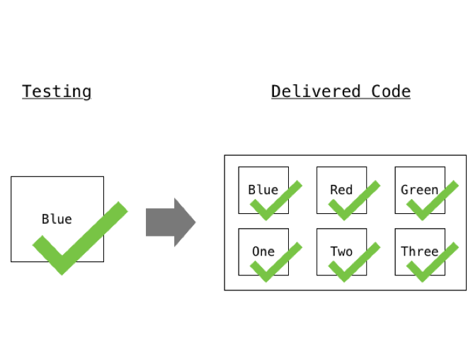
</p>

Software package delivery mechanism help releasing code to staging for review and inspection.

You might even decide to automatically deploy your new code into the production environment. This would be the *Deployment* phase where we would:

* Install the application
* Configure it for use

<p align="center"> 
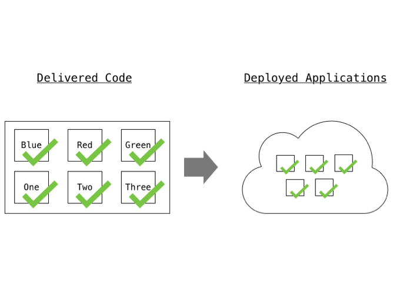
</p>

Relies on *Continuous Integration* and *Continuous Deployment* to automatically release code into production as soon as it is ready. This would mean a *constant* flow of new features into production.

The adjective *continuous*, applied to each of these phases, means that each code change will translate into a single deployment. Automation, flexible infrastructure and modular architectures will make it possible.

<p align="center"> 
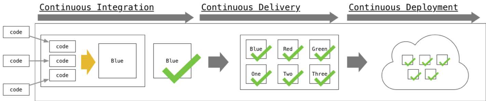
</p>

## Pipeline infrastructure

In order to accomplish the goal of integrating, delivering and deploying code in a continuous way, we need to build an architecture that is flexible enough to accommodate all requirements while remaining as standard as possible.

<p align="center"> 
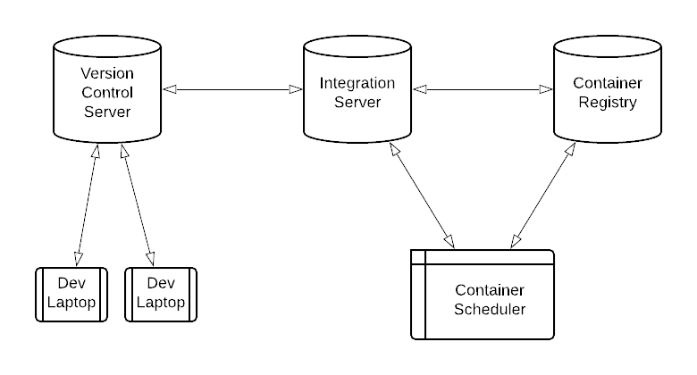
</p>

The proposed architecture includes a *Version Control Server* that manages code contributions from multiple developer systems into code repositories. It communicates with an *Integration Server* that follows a pre-defined pipeline of activities for each piece of code. These include testing code (ie. syntax, functional, performance testing, etc), triggering artifacts creation, publishing artifacts to a *Container Registry*, and even automatically creating deployments into a *Container Scheduler*.

You can choose the specific implementations you prefer to use for each of these elements. For our tutorial we have chosen the following:

* Version Control Server: GoGS
* Integration Server: Drone
* Container Registry: DockerHub
* Container Scheduler: Kubernetes cluster (the one we deployed on GKE)

<p align="center"> 
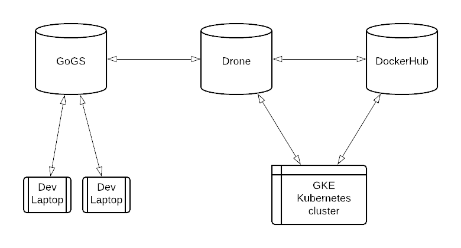
</p>

So we will use a Google Kubernetes Cluster (GKE) for our testing in this section.

### Version Control Server

We could have our developers use [GitHub](https://github.com) for source code version control. But if you like open-source alternatives you might also be interested in exploring a very simple, painless, private, self-hosted Git service, like [GoGS](https://gogs.io).

GoGS is available on containers (server and [Postgres](https://en.wikipedia.org/wiki/PostgreSQL) database), and you can easily deploy it into your k8s cluster with Helm. That means your version control server will be just another deployment in the same cluster where your applications reside. This is an important point: even though GoGS is functionally a separate entity from the scheduler, it is in fact deployed inside the scheduler.

An important remark is that its chart is not [stable](https://github.com/kubernetes/charts/tree/master/stable) yet, but rather resides under [incubator charts](https://github.com/kubernetes/charts/tree/master/incubator). You may find it [here](https://github.com/kubernetes/charts/tree/master/incubator/gogs).

So you will need to add the *incubator* repository to Helm:

```shell
helm repo add incubator https://kubernetes-charts-incubator.storage.googleapis.com/
```

You will also need to create a DNS entry that points to the GoGS LoadBalancer public IP address, so choose its name now and make sure it is available.

Now go into GoGS directory:

```shell
cd gogs
```

And edit *values.yml* to configure the following two values to make sure your GoGS installation uses them in its repo cloning syntax:

```yaml
serverDomain: <GoGS_public_URL>
serverRootUrl: http://<GoGS_public_URL>/
```

Save the file and you are ready to install GoGS:

```shell
helm install --name my-gogs -f values.yaml incubator/gogs
```

You will see a couple of messages from the helm install, on how to access your GoGS deployment, and how you need to register a first user (who, by the way, will become *admin*).

Please verify that both required pods (*gogs* and *postgresql*) are running and ready 1/1:

```shell
kubectl get pods
```

Wait until you get an external public IP address (ctrl+c to exit):

```shell
kubectl get service my-gogs-gogs -w
```

Now is the time to associate that public IP address to the DNS entry we mentioned before.

Once done, please verify the DNS entry has been correctly propagated:

```shell
dig <GoGS_DNS_entry> @8.8.8.8 +short
```

Point your laptop browser to that IP, your GoGS server is now ready!

Register your first user (it will also become *admin* for the server) and log into GoGS with your credentials. You might want to use the same username you use in GitHub for consistency.

You can create a new repository called *my-test*, just to verify the integration is working later on.

### Integration Server

There are several different options to implement your Integration Server. A very common options is [Jenkins](https://jenkins.io), but we have decided to use a different one, called [Drone](https://drone.io). The main reason is that Drone allows you to include the pipeline definition in your Git repo, instead of having to define the pipeline in the Integration server itself.

In a couple of minutes you will need to create a DNS entry that points to Drone LoadBalancer public IP address, so choose now the name you prefer and make sure it is available in your DNS.

Now go into the Drone directory:

```shell
cd ../drone
```

Copy the template file:

```shell
cp values.template values.yaml
```

And edit *values.yaml* to configure the public URLs you configured in DNS, for both GoGS and Drone servers:

```yaml
DRONE_HOST: "http://<drone_public_URL>"
DRONE_GOGS_URL: "http://<gogs_public_URL>"
```

Now you can install Drone. It is also available as containers, so again we will be able to use our k8s cluster to deploy it. And again Helm can help us with this task:

```shell
helm install --name my-drone -f values.yaml incubator/drone
```

Wait until you get an external public IP address for Drone (ctrl+c to exit):

```shell
kubectl get service my-drone-drone -w
```

Now is the time to associate that public IP address to the DNS entry we mentioned before.

Verify the DNS entry for Drone has propagated correctly:

```shell
dig <Drone_DNS_entry> @8.8.8.8 +short
```

And wait until your Drone pods are running and completely ready:

```shell
kubectl get pods
```

You may now point your browser to Drone public URL (the one you configured in your DNS), and login with your GoGS credentials.

You are now in! You will see that it automatically shows the repository you created in GoGS. Everything works!

In order to interact with Drone from your laptop you will need to [install Drone CLI](http://docs.drone.io/cli-installation/), and then configure it. You can get your token from Drone web interface, clicking on the 3-line list icon on the top right.

```shell
export DRONE_SERVER=http://<Drone_DNS_entry>
export DRONE_TOKEN=<TOKEN>
```

Check that it is working fine:

```shell
drone info
```

## Working with pipelines

Let's use our new CI/CD/CD pipeline infrastructure for *myhero*.

### Pipeline setup

First thing you will need to do is create repositories in GoGS for each one of its microservices:

* myhero_ui
* myhero_app
* myhero_data
* myhero_spark
* myhero_ernst

(note: you may now delete the *my_test* repo we created to verify the integration of GoGS and Drone)

For each one of them, go into its own directory inside *myhero*, replace the existing origin with the one in GoGS and push the code (you will need to provide your GoGS username and password). You may find below how you would do it for *myhero-ui*, but you will need to do the same for all of them:

```shell
cd myhero/myhero_ui
git remote remove origin
git remote add origin http://<GoGS_IP>/<GoGS_username>/myhero_ui.git
git push -u origin master
```

Now your *myhero_ui* code has been uploaded to its own repo in GoGS.

You may go to Drone web interface and refresh it to see the new repos show up. Activate all of them by clicking on the *switch* icon to the right of their names.

Activating these repos means that Drone will get a notification from GoGS when the content of a repo is updated. Not only that, Drone will also get the pipeline definition file *included inside the repo*. That file will define the sequential steps Drone needs to follow for the code included in that specific repo.

From Drone CLI in your laptop, you may now verify that all repos are active:

```shell
drone repo ls
```

### Pipeline definition and requirements

Our pipeline definition file will explicitly determine the different phases that code in the repo will go through when updated. Those include examples like *Test*, *Publish* or *Deploy*, depending on your specific requirements.

In our case, when new code is pushed to our repo we would like Drone to:

* Clone the updated repository from GoGS
* Build an updated Docker image based on the new code and Dockerfile included in the repo, and associate a unique tag to it
* Publish the new image to DockerHub
* Update the application deployment in our k8s cluster, with containers using the new image that was just published
* Notify us on pipeline execution results

For each one of these phases you will be able to use [Drone plugins](http://plugins.drone.io), so we have selected some plugins for the specific tasks we have defined in our pipeline. These plugins require you to provide some information in order to automate its activities.

For the *Publish* phase you will need to include your Dockerhub username and password, so that the system can automatically publish new images. As long as this type of information should not be in clear text, let's use Drone secrets (for that specific GoGS directory):

```shell
drone secret add \
  --repository <GoGS_username>/myhero_ui \
  --name docker_username --value <your_dockerhub_user>
drone secret add \
  --repository <GoGS_username>/myhero_ui \
  --name docker_password --value <your_dockerhub_password>
```

For the *Notify* phase we would like to use WebEx Teams, and let the system tell us when builds are complete and if they are successful or not. So please add this token (yes, you will need *that* specific token) and your WebEx Teams e-mail address, again in the form of Drone secrets:

```shell
drone secret add \
  --repository <GoGS_username>/myhero_ui \
  --name SPARK_TOKEN --value MDNiNTc0YTUtYTNmNC00N2EzLTg0MGUtZGFkMDYyZjI4YTYxMjhkY2EwNzgtOGYx
drone secret add \
  --repository <GoGS_username>/myhero_ui \
  --name PERSONEMAIL --value <your_WebEx_Teams_email>
```

For the *Deploy* phase we will use a Drone plugin called [drone-gke](https://github.com/NYTimes/drone-gke), designed to update existing deployments in Google Kubernetes Engine clusters. In order to do it this plugin needs you to provide the credentials [JSON](https://en.wikipedia.org/wiki/JSON) file of a Google service account to authenticate.

You can learn how to create a service account [here](https://cloud.google.com/storage/docs/authentication#service_accounts). Once done please download the resulting JSON file into your *myhero_ui* directory, and add it as a *secret* for your GoGS repo (remember to replace your GoGS_username and JSON filename)

```shell
drone secret add \
  --event push \
  --event pull_request \
  --event tag \
  --event deployment \
  --repository <GoGS_username>/myhero_ui \
  --name GOOGLE_CREDENTIALS \
  --value @<JSON_filename>
```

Please check all secrets are correctly configured now:

```shell
drone secret ls --repository <GoGS_username>/myhero_ui
```

### Pipeline implementation

You will find a template for your pipeline definition inside *myhero_ui* directory, in a file called *.drone.template*. Please copy it to it required name (*.drone.yml*).

```shell
cd myhero_ui
cp .drone.template .drone.yml
```

*.drone.yml* defines all required sequential steps in our pipeline, so please review it carefully. You will need to replace the following fields:

* Under *Publish* replace your DockerHub username in the image repository name (*repo*)
* Under *Deploy* replace zone, cluster and project, with the values from `gcloud container clusters list` (*Name* is *cluster*, *Location* is *zone*), and `gcloud projects list` (*Project_ID* is *project*)
* Under *Deploy*-*vars* replace your DockerHub username in the image repository name

*.drone.yml* needs a deployment definition file, so you will also need to copy the template files for *myhero-ui* deployment to the required names. These files will be used to define how *myhero-ui* will be deployed in GKE k8s cluster:

```shell
cp k8s_myhero_ui.template k8s_myhero_ui.yml
cp k8s_myhero_ui.sec.template k8s_myhero_ui.sec.yml
```

The first file (*k8s_myhero_ui.yml*) is very similar to the one we used previously to deploy this microservice on GKE. So the same as you did before, please complete the missing values of *myhero-spark* and *myhero-app* public URLs, the ones you configured in the DNS. The only difference you will find is that this version of the file defines the *image name* as a parameter. We will pass this parameter from the pipeline definition file (*.drone.yml*), based on the image name we build in the previous *Publish* phase.

The second file (*k8s_myhero_ui.sec.yml*) defines the Drone secrets (token and cert) required by the drone-gke plugin we use in the *Deploy* phase of our pipeline definition (*.drone.yml*). You will need to include the values for *api-token* and *p12-cert*. In order to get these values first check your list of secrets:

```shell
kubectl get secrets
```

Pick the one storing the drone token and extract the required values  (remember to replace the exact secret name with your specific one):

```shell
kubectl get secret/drone-deploy-token-XXXXX -o yaml | egrep 'ca.crt:|token:
```

Copy and paste each one of those *long strings* into the required fields of *k8s_myhero_ui.sec.yml* file (*token* is *api-token*, and *ca.crt* is *p12-cert*) and save it.

We are all set!

### Running your pipeline

The Drone plugin used during the *Deploy* phase of our pipeline will *update an already existing deployment*, so before running our pipeline for the first time, let's create the required initial deployment in our GKE k8s cluster.

```shell
kubectl apply -f ../devops/k8s/gce/k8s_myhero_ui.yml
```

Now our pipeline will be able to update the existing deployment with new images generated from changes to the source code.

Any new Git push to GoGS *myhero_ui* repo will automatically trigger its pipeline. For our first one we will need to add all modified files to the Git repo, commit and push to the GoGS server.

```shell
git add .
git commit -m "Required files for pipeline execution"
git push -u origin master
```

Due to the integration we configured between the GoGS and Drone servers, a webhook will automatically trigger a new build in the Drone server. You may see it happening in real time via the Drone web user interface in your browser.

<p align="center"> 
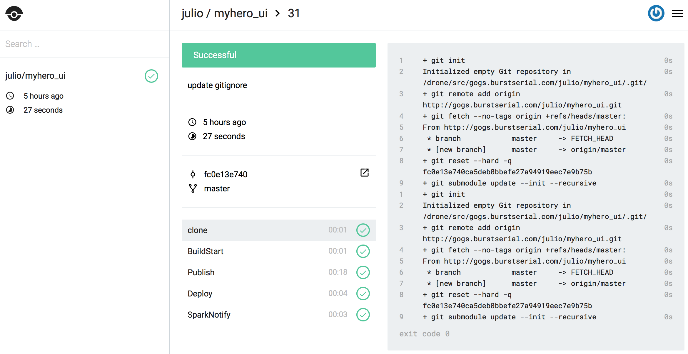
</p>

Once completed you will receive a WebEx Teams message from the *CICD Build Bot* saying your build was successful.

<p align="center"> 
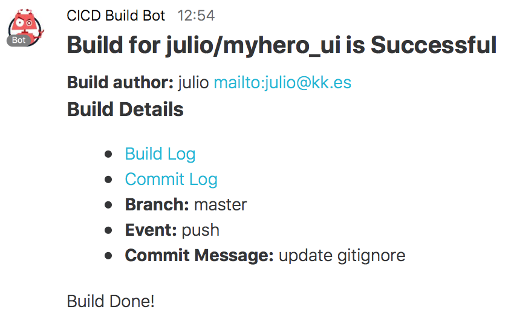
</p>

Let's see it working with new code. We will change *myhero-ui* microservice code and see how it goes through the pipeline and is automatically deployed.

Access your deployed *myhero-ui* web interface via its service public IP address:

```shell
kubectl get svc myhero-ui
```

Point your browser to that external IP address and you will see something like this:

<p align="center"> 

</p>

As you can see there is no info on the available superheroes to vote, or what are the current standings. The reason is that we have only deployed *myhero-ui*, and none of the other microservices required to have a working application.

If your cluster has enough resources to deploy all the other microservices feel free to go for it. GKE clusters default configuration use 3 nodes of the [default node machine type (n1-standard-1)](https://cloud.google.com/kubernetes-engine/docs/concepts/cluster-architecture#node_machine_type). We used this configuration and it does not support the complete *myhero* deployment with the desired number of replicas per microservice, and the GoGS and Drone servers. So instead of deploying every *myhero* microservices we will work with just one of them (*myhero-ui*), and demonstrate pipeline capabilities all the same.

As per the web page above you can see the current heading is "Make your voice heard!". Let's change the code in our repository so it reads "Make your voice HEARD!!!".

This change is equivalent to any other change you made, as a developer, in your code. Our pipeline does not differentiate the type of change, it just detects that the repo changed and executes the pipeline.

Let's change directory to the location where the HTML code for this page reside:

```shell
cd app/views
```

There you need to edit the *main.html* and make the mentioned change in the text you will find there.

Once done save the file and check if Git has detected the change:

```
git status
On branch master
Your branch is up-to-date with 'origin/master'.
Changes not staged for commit:
  (use "git add <file>..." to update what will be committed)
  (use "git checkout -- <file>..." to discard changes in working directory)

	modified:   main.html

no changes added to commit (use "git add" and/or "git commit -a")
```

You will need to add its new version to Git:

```shell
git add main.html
```

You can see how Git is now waiting for this file change to be committed:

```
git status
On branch master
Your branch is up-to-date with 'origin/master'.
Changes to be committed:
  (use "git reset HEAD <file>..." to unstage)

	modified:   main.html
```

Commit this change:

```
git commit -m "update main.html"
[master e95bb1c] update main.html
 1 file changed
````

And now push it to the repo defined as *origin* (you may check it refers to your GoGS server with `git remote show origin`):

```
git push -u origin master
Counting objects: 5, done.
Delta compression using up to 8 threads.
Compressing objects: 100% (5/5), done.
Writing objects: 100% (5/5), 430 bytes | 0 bytes/s, done.
Total 5 (delta 4), reused 0 (delta 0)
To http://gogs.XXXXXXXX.com/julio/myhero_ui.git
   382cf86..e95bb1c  master -> master
Branch master set up to track remote branch master from origin.
```

This will automatically trigger a new build and deployment update. If you refresh your browser you should see now something like this:

<p align="center"> 

</p>

Please notice the heading has changed to "Make your voice HEARD!!!".

This means that just by pushing new code to your repo, it automatically triggered the whole pipeline process that ended up with your deployment being updated! How cool is that??

You may now start to see how different life would be for a DevOps team that implemented a CI/CD/CD pipeline.

* Developers might work on creating code locally in their laptops and test it in their own local container runtime engine. In fact they could even deploy a 1-node k8s cluster in their own laptops if they were interested! Recent Docker releases include this capability for standard laptop installations.
* Once they are happy with the working code they could push it to a repository, and that would automatically trigger a pipeline execution.
* That pipeline could include things like automatically testing the code, and if successful create new container images and update the deployments in production with the new code.

Every new feature would be tracked by a Version Control Server, then implemented in a new image, tested, and translated into its own deployment. Everything automatic and based on containers to eliminate dependency issues.

This looks like a new world!

### Pipeline on-premises

If you want to deploy CI/CD/CD in your own on-prem setup you will need to do things a little bit different. Once GoGS and Drone are installed via Helm and ready, you will need to define your pipeline. It will be really similar to the one you did for GKE, but will need a different Drone plugin for the *Deploy* phase.

We will use [this Drone plugin for on-premises Kubernetes deployments](http://plugins.drone.io/mactynow/drone-kubernetes/).

If you created a specific namespace for your *myhero* deployment (ie. *myhero*) you will not be able to use the default service account, because by default it cannot update deployments in other namespaces. Instead, you will need to create a *custom service account* with the appropriate permissions (*Role* and *RoleBinding*, or *ClusterRole* and *ClusterRoleBinding* if you need access across namespaces using the same service account).

In your Kubernetes *master* node please run:

```shell
cd devops/drone
kubectl apply -f on-prem-rbac.yaml
```

Once the service account is created, you will need to extract the *token* for that service account:

```shell
kubectl -n myhero get secrets
# Substitute XXXXX below with the correct one from the above command
kubectl -n myhero get secret/drone-deploy-token-XXXXX -o yaml | egrep 'token:'
echo [ your k8s base64 encoded token ] | base64 -d && echo''
```

Now from your Dev laptop you need to edit the *.drone.yml* file in your *myhero_ui* directory and replace the *Deploy* phase with the following content:

```yaml
  Deploy:
    image: quay.io/honestbee/drone-kubernetes
    deployment: myhero-ui
    repo: juliocisco/myhero-ui
    kubernetes_server: https://<your_k8s_master>
    kubernetes_token: <your_k8s_token>
    container: myhero-ui
    namespace: myhero
    tag: ${DRONE_COMMIT}
```

You are now ready to test your on-premises pipeline, the same way you did it in the previous section.

---

# Additional tools

Now you know how Developers and Operations teams work, what are some of the challenges they face, how to work around them and specifically how a CI/CD/CD pipeline might help.

But there are additional tools to address certain needs, that provide multiple benefits and are of great interest to them.

## Draft

[Draft](https://draft.sh) enables developers to easily build applications and run them in k8s. It helps by hiding the complexity of building images, publishing them and creating the deployments. That way developers can focus on code. With only a couple of commands (`draft create` and `draft up`) they are good to go!

Let's imagine there was a team working on our *myhero-data* microservice. They would be [python](https://www.python.org) coders constantly expanding its functionality and testing that it works fine. They would need to test it before going to Production, but testing it correctly implies deploying into a similar k8s cluster. However these coders should not be concerned about k8s management, they just want to code!

So once their code is ready they could use Draft to automatically detect the programming language they use, create the required packaging info, build the required images and automatically create a deployment into a k8s test cluster.

Let's get it working!

First [install Draft](https://github.com/azure/draft). If you choose to use minikube you will have a 1-node k8s cluster running in your own laptop for testing. Otherwise you can use any k8s cluster from a Cloud provider.

Now go to *devops-tutorial* create a new *draft* directory, clone there the *myhero_data* repo and rename it to *myherodata* (draft does not support the **_** character in deployment names):

```shell
cd devops-tutorial
mkdir draft
git clone https://github.com/juliogomez/myhero_data.git
mv myhero_data myherodata
```

Go into the new directory and containerize the app by creating a draft pack.

```shell
cd myherodata
draft create
```

This will create the required Helm chart structure and config file (*draft.toml*). It would also create a default Dockerfile, but we already have one with everything we need.

Let's quickly configure this for our specific microservice:

* Edit *myherodata/charts/python/values.yaml* and do 3 things:
1. Replace the default service.internalPort from 8080 to 5000, which is the port defined in our Dockerfile. 
2. Change service.type from *ClusterIP* to *NodePort*, so that the service is accessible from your laptop.
3. Disable ingress access by adding the following 2 lines at the end of the file:

```yaml
ingress:
  enabled: false
```

* Edit *myherodata/charts/python/templates/deployment.yaml* to include the required environment variable under spec.template.spec.containers:

```yaml
  env:
    - name: myhero_data_key
      value: SecureData
```

We are all set! Now you just need to run:

```shell
draft up
```

And it will automatically initiate the process to build the image, push it to your local registry and deploy the microservice in your local k8s cluster (minikube).

As you can see, no k8s management is required from the developer, Draft does everything for him.

Now you can connect to your deployment, although it may take a couple of minutes until Pods are ready. Check with:

```shell
kubectl get pods
```

Once Pods are up and running, check the IP address for your *myherodata-python* to use by running:

```shell
minikube service list
```

In my case I got the following: http://192.168.99.100:31833

So go ahead and test access via its API with:

```shell
curl -X GET -H "key: SecureData" http://192.168.99.100:31833/options
```

Success!

As developers, let's modify our code and see how easy it is to update the deployment. Please edit *sample_heros.txt* remove one of the entries, and save the file. With any change you make to your code, you just need to issue again:

```shell
draft up
```

And it will automatically upgrade the deployment in your local k8s cluster (minikube). You may see the effect of your changes by querying the API again:

```shell
curl -X GET -H "key: SecureData" http://192.168.99.100:31833/options
```

Easy!

When you are done, you can delete your deployment by executing:

```shell
draft delete
```

In summary, a python developer creates a microservice called *myhero-data*. Before sending it to production he wants to test it in a similar environment. Using Draft he can test his new code with just a couple of commands, and without having to manage the k8s cluster he is using.

How cool is that?!

## Telepresence

[Telepresence](https://www.telepresence.io) allows you to work from your laptop like you were *inside* a remote k8s cluster. This way you can easily do *live* debugging and testing of a service locally, while it is automatically connected to a remote k8s cluster. For example you could develop on that local service and have it connnected to other remote services deployed in Production.

Let's give it a try to see how it works.

First you need to [install it](https://www.telepresence.io/reference/install), and it will automatically work with the k8s cluster active in your kubectl configuration.

Now you should already know how to get a full *myhero* deployment working on your GKE cluster, so please go ahead and do it yourself. To make it simpler let's configure it in 'direct' mode, so no *myhero-mosca* or *myhero-ernst* is required. Remember you just need to comment with **#** two lines in *k8s_myhero_app.yml* (under 'env' - 'myhero_app_mode'). After deployment you should have the 3 required microservices: *myhero-ui*, *myhero-app* and *myhero-data*. Please make sure to configure *myhero-ui* and *myhero-app* as LoadBalancer, so that they both get public IP addresses.

When you are ready you can try Telepresence in a couple of different ways:

* Additional local deployment that communicates with the existing remote ones.
* Replace an existing remote deployment with a local one.

### Additional deployment

In the first case you could run an additional container locally, and have full connectivity to the remote cluster, as if it were actually there. Let's try with *Alpine* and make it interact **directly** with *myhero-data* and *myhero-app* using their service names. Please note these service names are only reachable **inside** the cluster, never from an external system like our laptop. But with Telepresence we can do it!

Start by running Alpine with Telepresence:

```shell
telepresence --docker-run -i -t alpine /bin/sh
```

And now from inside the Alpine container you may interact directly with the already deployed *myhero* containers:

```shell
apk add --no-cache curl
curl -X GET -H "key: SecureData" http://myhero-data/options
curl -X GET -H "key: SecureApp" http://myhero-app/options
curl http://myhero-ui
```

As you can see the additional Alpine deployment can query existing microservices using k8s service names, that are only accessible by other containers inside the k8s cluster.

### Swap deployments

For the second case Telepresence allows you to replace an existing remote deployment in your k8s cluster, with a local one in your laptop where you can work **live**.

We will replace the *myhero-ui* microservice running in your k8s cluster with a new *myhero-ui* service deployed locally in your laptop.

Before running the new local deployment please find out what is the public IP address assigned to *myhero-app* in your k8s cluster (you will need it as a parameter when you run the new *myhero-ui*):

```shell
kubectl get service myhero-app
```

Now you can replace the remotely deployed *myhero-ui* with your own local *myhero-ui* (please make sure to replace the public IP address of *myhero-app* provided as an environment variable in the command below):

```shell
cd myhero_ui/app
telepresence --swap-deployment myhero-ui --expose 80 --docker-run -p=80 -v $(pwd):/usr/share/nginx/html -e "myhero_app_server=http://<myhero-app_public_IP>" -e "myhero_app_key=SecureApp" <your_DockerHub_user>/myhero-ui
```

Parameters indicate what is the port used by the remote deployment (*-expose*), what port uses the local container (*-p*), mapping of the application directory from the local host to the container, required environment variables (*myhero-app* URL or public address, and shared private key), and finally your *myhero-ui* image.

You will probably be asked by your laptop password to allow the creation of a new local container. And finally the terminal will start logging your local *myhero-ui* execution.

Open a new terminal and check the public IP address of your *myhero-ui* service:

```shell
kubectl get service myhero-ui
```

Now point your browser to that Public IP address and you should see *myhero* app working as before.

From the second terminal window go to the application directory:

```shell
cd myhero_ui/app/views
```

Let's modify the code of our *myhero-ui* microservice frontpage, by editing *main.html*:

```shell
vi main.html
```

In the second line you will find a line that says:

```html
<h3>Make your voice heard!</h3>
```

Modify it by swapping *voice* to *VOICE*:

```html
<h3>Make your VOICE heard!</h3>
```

Save the file. Please note this is just an example of a simple change in the code, but everything would work in the same way for any other change.

Refresh your browser and you will automatically see the updated header (shift+refresh for a hard refresh) from your **local** *myhero-ui*.

Let's review what is happening: requests going to *myhero-ui* service **public** IP address are automatically redirected to your **local** *myhero-ui* deployment (where you are developing *live*), which in turn transparently interact with all the other *myhero* microservices deployed in the **remote** k8s cluster.

Ain't it amazing?!?

When you are happy with all code changes you could rebuild and publish the image for future use:

```shell
cd myhero-ui
docker build -t <your_DockerHub_user>/myhero-ui
docker push <your_DockerHub_user>/myhero-ui
```

When you are done testing your local deployment, go to your first terminal window and press ctrl+c to stop Telepresence. You might get asked for your laptop password again, to exit the local container. At this point the remote k8s cluster will **automatically** restore the remote deployment with its own version of *myhero-ui*. That way, after testing everything remains as it was before we deployed our local instance with Telepresence. Really useful!

---

# Conclusions

Kudos to you, we have travelled a **really** long path since we started! We covered how Developers work in their local environment and what are some of the challenges they face on a daily basis. You built and published your first set of containers, and deployed them locally to build a real microservices-based application.

Later we covered two different options for Operations teams working on remote environments: on-premises and public Cloud. For on-prem we saw how you can build your own miniDC and deploy a real application on it. We deployed different user interfaces and solved some scalability challenges suffered by real applications. Then you got familiar with public Cloud environments and how deployments work there vs on-prem.

Later on we moved to the benefits of CI/CD/CD and how to implement the required infrastructure in your own setup. We created a pipeline for our application and saw it working. Finally we discussed additional tools that provide multiple benefits for DevOps teams.

By now you have quite an understanding of DevOps challenges and possible solutions. What are their concerns and what are some of the tools we can use to address them. You are now one of us, congratulations!

<p align="center"> 

</p>